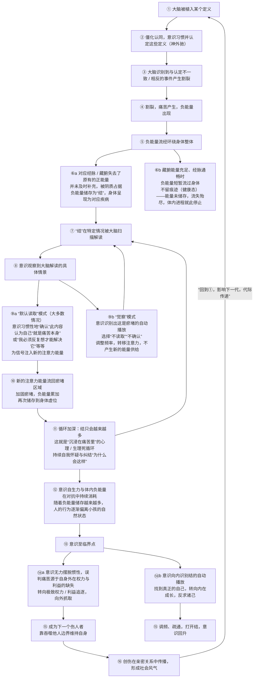
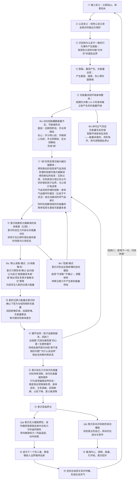

# 中卷

## 一、具体概念是什么 存在身体内的负能量干扰意识

### 1.1 具体的概念：创伤储存在经脉里时不时影响着人

创伤不是抽象的 “想不开”，也不是只存在于人的记忆。它有一个很容易被忽略的具体位置：身体。痛苦的经历在发生时，如果意识没有真正消化，它不会凭空消失，而会以 “负能量 / 结” 的形式，真实储存在身体经脉和藏腑的阳气空缺处。这个储存不是一种比喻，而是这一概念内部的身体层面能量现象。委屈、伤心、恐惧、割裂感，会沿着各自的路径流向经脉与藏腑，在那些原本就缺少正气、没有及时补充的位置停留下来，形成瘀堵。

这些瘀堵通常会安静地待在那里。它们带有特定频率，而大脑会经常扫描、识别、共振和解读这些负面频率的储存，并汇报给意识。然后意识就会在记忆中调取与这段负能量同频的内容：一个被伤害的场景、一句无法反驳的话、一种 “我又回到了那里” 的感觉。意识调取出这些内容后，很容易误以为痛苦就是自己，因为痛苦是从身体内部升起的，不是从外面来的，所以它显得格外真实。

因此，这里的具体概念是：存在身体内的负能量会干扰意识。人体内的每一处 —— 包括意识和身体 —— 都是相互影响、牵一发而动全身的整体，它是一个完整的系统。负能量不是单独存在于某一处的 “心理问题”，而是整个系统里的一处处瘀堵。当一处经脉或藏腑被 “负能量 / 结” 占据，它会反过来干扰意识的判断和感受，让意识反复陷入同一种痛苦。这种干扰之所以难以摆脱，不是因为想法错了，而是因为身体内存储着实实在在的负能量，有一个真实的能量落点；意识每一次被大脑读取这个落点牵引，都会把每个当下可调取的能量调频成负能量，让本人持续处在负面的环境中。

大脑解读之后，意识并不是只能被动承受。它有两条路：如果处于 “默认读取” 模式，意识会习惯性地确认这些内容，认为自己 “就是痛苦本身”，或认为 “必须反复想才能解决它”，也可能想 “我为什么会经历这些” 等等诸如此类，于是为信号注入新的注意力能量，使人处于负能量中；但如果处于 “觉察” 模式，意识识别出这只是瘀堵的自动播放，选择 “不读取”“不确认”，调整频率，转移注意力，就不再产生新的能量供给。这是同一个概念里同时包含的干扰机制与出路。

概念还有另一面。意识本身有 “光和爱” 的调频能力，可以转念、疏通，让身体更健康，让意识更多地从负能量中走出来。痛苦虽然真实储存在经脉和藏腑里，但意识的调频能力可以改变与这些储存的关系。调频不是否认痛苦，而是不再把瘀堵的自动播报当成完整的自我。身体可以通过疏通和正气恢复，让负能量不再有长期停留的条件。换句话说，创伤储存在经脉里，并不是一个无法逆转的判决，而是一个需要从身体和意识同时入手的瘀堵问题。

还需要说明边界条件：并不是每一次痛苦都会变成身体里的结。如果经历痛苦时，对应经脉和藏腑能量充足、经脉通畅，负能量只是短暂流过身体，不留痕迹，这是健康态。只有对应经脉与藏腑失去了原有的正能量、并未及时补充时，负能量才会储存下来，身体也可能呈现某种传统理论中的不适状态。（声明：这不是诊断标准，不能替代医学检查。）这个区别解释了为什么同样经历痛苦，有的人恢复得快，有的人却长期被同一个创伤反复影响。关键不在于 “痛苦大不大”，而在于那个痛苦流经身体时，身体有没有足够通畅的通道和充足的正气让它离开。

所以，“创伤储存在经脉里时不时影响着人”，指的不是一种文学化说法，而是说创伤在身体内有具体的存储位置和干扰路径。它会在特定情况被大脑扫描、解读，让意识在当下还因为曾今的经历感到心痛；同时，它也受到意识情绪调整调频和身体经脉通畅度的影响。这个概念把心理痛苦从单纯的头脑记忆放到 “身体 — 意识” 的完整系统中，为后面理解创伤来源、定义固化、负能量储存、大脑汇报和调频能力提供了基础。

### 1.2 流程图

一流程三岔口

下文是作者察觉到的，人从空白（婴幼儿）到持续产生心理痛苦的概述流程图，同时附带例子方便理解



> 说明：上方的 Mermaid 流程图在 GitHub 网页版会自动渲染。若你的阅读工具不支持 Mermaid（预览显示失败或只见代码），请阅读下方字符版原图——两者内容完全一致，字符版在任何工具中都能正常显示。

```text
字符版原图（与上方 Mermaid 内容一致，供不支持 Mermaid 的工具阅读）

① 大脑被植入某个定义
   ↓
② 僵化认同，意识习惯并认定这些定义（神外驰）
   ↓
③ 大脑识别到与认定不一致 / 相反的事件产生割裂
   ↓
④ 割裂，痛苦产生，负能量出现
   ↓
⑤ 负能量流经环绕身体整体
   ↓
├─ ⑥a 对应经脉 / 藏腑失去了原有的正能量，并未及时补充，被阴质占据
│     负能量储存为“结”，身体呈现为对应疾病
│     ↓
└─ ⑥b 藏腑能量充足、经脉通畅时，负能量短暂流过身体，不留痕迹（健康态）
      （能量未储存，流失殆尽，体内进程就此停止，不进入后续步骤）
⑦ “结”在特定情况被大脑扫描解读
   ↓
⑧ 意识观察到大脑解读的具体情景
   ↓
⑨a “默认读取”模式（大多数情况）：
     意识习惯性地“确认”此内容，认为自己“就是痛苦本身”
     或“我必须反复想才能解决它”等等，为信号注入新的注意力能量
     ↓
⑩ 新的注意力能量流回瘀堵区域，加固瘀堵，负能量累加，再次储存到身体虚位
     ↓
⑪ 循环加深：结只会越来越多 → 回到⑦
     （这就是“沉浸在痛苦里”的心理 / 生理死循环，持续自我怀疑与纠结“为什么会这样”）
     ↓
⑫ 意识自生力与体内负能量在对抗中持续消耗，随着负能量储存越来越多，
     人的行为逐渐偏离小孩的自然状态
     ↓
⑬ 意识至临界点
     ↓
⑭a 意识无力摆脱惯性，误判痛苦源于自身外在权力与利益的缺失
     转向极致权力 / 利益追逐，向外抓取
     ↓
⑮ 成为下一个伤人者，靠吞噬他人边界维持自身
     ↓
⑯ 创伤在亲密关系中传播，形成社会风气
     ↓
     回到①，影响下一代，代际传递

⑨b “觉察”模式：
     意识识别出这是瘀堵的自动播放，选择“不读取”“不确认”
     调整频率，转移注意力，不产生新的能量供给 → 回到⑦

⑭b 意识向内识别结的自动播放，找到真正的自己
     转向内在成长，反求诸己
     ↓
⑮ 调频、疏通，打开结，意识回升
```


### 1.3 例子



> 说明：上方的 Mermaid 流程图在 GitHub 网页版会自动渲染。若你的阅读工具不支持 Mermaid（预览显示失败或只见代码），请阅读下方字符版原图——两者内容完全一致，字符版在任何工具中都能正常显示。

```text
字符版原图（与上方 Mermaid 内容一致，供不支持 Mermaid 的工具阅读）

① 植入定义：父爱如山，母爱如水
   ↓
② 认定定义：线性认定父母会绝对的做出为我好
   ↓
③ 识别到与认定不一致的行为事件产生割裂：我受到父母的叫做“为你好”的侵犯边界
   ↓
④ 割裂，痛苦产生，负能量出现：产生委屈、疑惑、伤心等负面情绪
   ↓
⑤ 负能量流经环绕身体整体：短期内大概 1-6 小时身体被之前产生的负能量环绕
   ↓
├─ ⑥a 对应经脉藏腑能量不足，可能储存在
│     委屈：足厥阴肝经、手太阴肺经
│     伤心：手少阴心经、手厥阴心包经、手太阴肺经、足太阴脾经
│     形成“结”
│     ↓
└─ ⑥b 体内正气充足，负能量无处存储，短暂环绕身体后流失
      （能量未储存，流失殆尽，体内进程就此停止，不进入后续步骤）
⑦ “结”在特定情况被大脑扫描解读：
     得到类似的信息或气血流经存储的经脉时被大脑解读
     得到类似的信息：见到父母，见到其他父母正在以为你好侵犯孩子边界，与父母打电话等
     气血流经存储的经脉：身体气血循环时留驻（比如子午流注）或主动被动的将气血牵引
     同时包括解读结的负能量的频率信息与激发负能量本身
   ↓
⑧ 意识观察到大脑解读的具体情景（幻想）：
     意识的自生力开始与负能量对抗，体现于在幻想中我在被伤害的场景对父母反抗
   ↓
⑨a “默认读取”模式（大多数情况）：
     意识习惯性地“确认”此内容，认为自己“就是痛苦本身”
     或“我必须反复想才能解决它”等等，为信号注入新的注意力能量
     ↓
⑩ 新的注意力能量在意识的确认下变为与结同频的负能量，流回瘀堵区域
     加固瘀堵，负能量累加，再次储存到身体虚位
     ↓
⑪ 循环加深：结只会越来越多 → 回到⑦
     （这就是“沉浸在痛苦里”的心理 / 生理死循环
      持续自我怀疑与纠结“是不是我的问题”“为什么会这样”：我处在抑郁内耗状态）
     ↓
⑫ 意识自生力与体内负能量对抗持续消耗，体内负能量越来越多，行为逐渐偏离自然状态：
     我逐渐出现情绪失控、身体症状、关系扭曲、自我麻痹、认知下降、意义崩溃等
     ↓
⑬ 意识至临界点
     ↓
⑭a 意识无力摆脱惯性，误判痛苦根源是自身外在权力与利益的缺失
     转向极致权力 / 利益追逐，向外抓取
     ↓
⑮ 成为下一个伤人者，靠吞噬他人边界维持自身
     ↓
⑯ 创伤在亲密关系中传播，形成社会风气
     ↓
     回到①，影响下一代，代际传递

⑨b “觉察”模式：
     意识识别出这是瘀堵的自动播放，选择“不读取”“不确认”，调整频率
     转移注意力不产生新的能量供给 → 回到⑦

⑭b 意识反向识别结的自动播放，找到真正的自己
     转向内在成长与哲学
     ↓
⑮ 看清内心、调频、疏通，打开结，意识回升
```


## 二、追溯创伤的来源

### 2.1 痛苦源于伤害 —— 创伤即有伤人者与被伤者

痛苦不是凭空产生的，不是 “想多了”，也不是 “太脆弱”。它最初几乎总是一个具体的事件 —— 有人做了某件事，有人承受了某个后果。创伤的本质是关系事件：有施加方，有承受方；有施予痛苦的一方，有承受痛苦的一方。

即使后来创伤内化成身体里的 “结”，即使痛苦在多年后已经脱离了最初的事件独立运转，它的起点仍然在人与人之间。理解创伤，不能只盯着被伤者的痛苦，还要看见痛苦是如何在关系中衍生出来的，以及那个施加伤害的人，为什么会这样做，又为什么常常不认为自己做了。


***

一、有明确伤人者的创伤

这类创伤最容易辨认，也最常被承认。

家暴中的施暴者与受害者，性侵中的加害者与幸存者，校园霸凌中的霸凌者与被霸凌者，职场 PUA 中的上司与下属，亲密关系中的精神控制者与被控制者 —— 在这些关系里，伤害的方向是清楚的：有人主动或过失地造成了另一个人的痛苦。责任在伤人者，被伤者不需要为伤害的发生负责，无论自己当时做了什么、没有做什么。

这种明确性很重要。它让痛苦有了一个可指向的对象，让意识不至于完全困在 “是不是我的错” 的自我怀疑里。被伤者可以对那个明确的对象说：“你伤害了我。” 这句话本身就是一种保护 —— 它让痛苦有地方去，而不是全部转向内部攻击自己。

但明确性并不减轻痛苦。知道是谁伤害了你，不等于伤就不痛了。被明确伤害的人，身体里同样会储存着恐惧、愤怒、委屈的结。那些负能量会沿着具体的情感路径流向经脉和藏腑，在正气不足的地方停留下来。知道是谁伤害的，并不会让结自动消失。结的形成机制是一样的 —— 身体在受伤的那一刻没有能力让负能量完全流过，它留下了痕迹。

案例：亲密关系中的精神控制（声明：案例均经过大幅改编和匿名化处理，不指向任何具体个人。）

丽丽和男友在一起多年。最开始男友对她很好，体贴、周到、无微不至。慢慢他开始查她手机，问她 “刚才和谁聊天”“为什么笑那么开心”。再后来，他开始限制她的社交 —— 她跟朋友出去玩，他说 “你陪她们的时间比陪我还多”；她加班晚回来，他说 “你这么晚回来，有没有考虑过我的感受”。

丽丽开始觉得不对。她和朋友说，朋友说 “他太爱你了才会这样”。她去问男友，男友说 “我都是因为在乎你，你看外面那些男人谁管女朋友死活”。她无法反驳，因为这句话听起来太合理了。

她开始自我怀疑：是不是我真的太不顾他的感受了？是不是他管我是因为爱我？是不是我太不知足了？

她不知道的是，她的身体已经先于意识给出了答案：她开始失眠，每次听到男友的脚步声就心跳加速，接到他的电话会下意识地深呼吸。她的心经和肝胆经里正在储存 “被控制” 的结 —— 那些无法说出口的委屈、不敢承认的愤怒，都在身体里找了位置住下来。她以为自己 “只是在谈恋爱”，实际上她正在被伤害。


***

二、没有明确 “伤人者” 的创伤

有些创伤来自非人为事件或环境，没有可以指责的 “人”。

地震、洪水、火灾、车祸、空难、突发疾病、难产、亲人自然死亡 —— 这些经历同样会造成深重痛苦，但被伤者面对的是命运、偶然、自然力量，而不是某个蓄意伤害自己的人。

这类创伤并不因为缺少加害者就更轻，有时反而更让人感到无助和困惑。因为没有外部对象可以去恨、去追责，痛苦没有出口。意识便容易把它转向自身，反复问 “为什么是我”。

在这种情境下，身体里的负能量依然会储存，只是它没有一个清晰的人际指向。它往往混同着无力感和对世界不可控的恐惧，滞留在相应经脉与藏腑的空缺处。这类创伤的 “结” 常常更深 —— 因为它们没有被言说的机会，没有可以指向的出口。被伤者只能自己消化，而消化不了的，就成了身体里的瘀堵。

这也提醒我们：创伤的根源不一定是恶意，但痛苦的储存机制是一样的。天灾人祸不因人的意志转移，它们留下的痕迹同样真实。


***

三、伤人者本身也可能曾是受害者

这是一个不容易面对的事实：很多伤害别人的人，自己也曾是创伤的受害者。

一个从小被打的孩子，长大后可能成为打孩子的父母。一个在暴力环境中长大的人，可能学会用暴力解决问题。一个在控制型家庭里长大的人，成年后可能也变成一个控制者。一个曾被性侵的人，如果内心没有得到抚慰，可能在亲密关系中重复伤害模式。

这不是在为伤人者开脱，而是说明创伤具有传递性。如果未被看见和处理，它可能从一代传到下一代，从一个人传到另一个人。伤人者的体内同样有未被疏通的 “结”—— 那些结是他们童年时期储存下来的负能量。在他们成为伤人者时，这些瘀堵会推动他们重复旧的模式。

但重要的一点是：“我也受过伤” 不能成为继续伤害别人的理由。

一个人可以理解自己为什么会这样做，但理解不等于允许自己继续这样做。每个人都需要为自己的行为负责，尤其是当自己成为伤人者时。看见伤人者曾经受伤，不是为了免除责任，而是为了理解创伤如何在人之间传递，从而有机会在链条中打断它。


***

四、被伤者也可能在无意中伤害他人

创伤会改变一个人的情绪、行为和关系模式。有些被伤者在痛苦中，可能会对亲近的人发脾气、冷暴力，过度控制或过度依赖，因为恐惧而推开真正关心自己的人，把过去的愤怒投射到现在的伴侣、孩子身上。

这时，被伤者也可能在关系中造成新的伤害。

一个从小被忽视的人，在亲密关系中可能极度缺乏安全感，不断索取关注、不断测试对方、让对方疲惫不堪。一个从小被贬低的人，在职场中可能用同样的方式贬低下属 —— 他自己都不知道自己在做什么。

这不是 “受害者有罪”，不是说被伤者活该。而是说创伤需要被正视，否则痛苦会持续向周围蔓延。意识若深陷惯性中，会不断把身体里的旧结负能量投射到当下的自己和他人身上，因过去的伤让当下还感到痛苦，并在创伤痛苦的干扰下无意间伤害身边人。于是，被伤者可能在无意中成为新的伤人者，把体内的负能量传递出去。

很多心理治疗不仅帮助被伤者减轻痛苦，也在帮助他们停止 “用被伤害的方式去伤害别人”。调频不只是让自己舒服，也是不再让瘀堵外溢。

前面案例，丽丽的男友很可能在从小就被忽视，导致他在往后的亲密关系中极度缺乏安全感，不断索取关注、不断测试丽丽，让让丽丽疲惫不堪，无意识间伤害到了丽丽。丽丽的男友本身就在创伤中挣扎。并且他早已在无意识间，将未被处理的创伤也就是 “结”，内化到行为模式里。


***

五、为什么伤人者常常不认为自己造成了伤害

这是创伤关系中最令人困惑也最令人痛苦的一个现象。

伤人者和被伤者对 “这是否是伤害” 的判断往往不对称。伤人者常常不认为自己造成了伤害，甚至觉得自己才是被误解、被冤枉的一方。这种不对称会让被伤者陷入更深的自我怀疑，反复问：“是不是我太敏感了？”“他都说不是故意的，我是不是不该这么难受？”“为什么只有我觉得难过，他却觉得什么都没发生？”

要理解这种不对称，不能只停留在 “他坏” 或 “我太敏感”，而要看伤人者的意识如何被定义、防御和自身瘀堵遮蔽。这不是单纯的是非问题，而是一整套机制在起作用。

第一，意图不能抵消影响。

伤人者往往用 “我不是故意的” 来否定伤害的存在。但心理创伤的关键不在于对方的意图，而在于被伤者的真实感受和实际受到的影响。

一个人可以毫无恶意，却依然造成伤害。父母说 “我打你是为你好”，老师说 “我骂你是恨铁不成钢”，伴侣说 “我控制你是因为太爱你”。这些行为可能确实没有主观恶意，但对承受者带来的恐惧、羞耻、无力感是真实的。

伤人者把 “意图” 当成伤害是否成立的唯一标准，混淆了动机和后果。

这其实是一种以强调动机纯洁来逃避后果责任、同时抬高自身道德姿态、进而对冲内心负罪感获取心理安慰、和从对方身上获得更多利益的常用话术和心理机制。

甚至他们还会给自己洗脑并认定 “只要我不是故意，就不算伤害”“我为你这么好，你竟然反抗”。这些个定义让他们的意识无法看到对方的真实状态，因为大脑只会按照已有的定义去解读事件。凡是不符合 “我是为你好” 这一框架的反馈，都会被视作对方的误解或过度反应。

第二，心理防御机制在自动运行。

承认自己伤害了别人，尤其是伤害了自己在乎的人，会引发强烈的内疚、羞耻和自我否定。为了避免这种痛苦，伤人者会不自觉地使用否认、合理化、最小化、投射、反向指责等防御方式。

他们说 “我没做过”“没那么严重”“大家都这样”“是你太敏感”“是你先惹我的”，甚至反过来把自己说成受害者。这些防御让他们不必面对自己的责任，但也让被伤者更加孤立。

这些防御也是一种瘀堵的自动反应。伤人者体内可能储存着大量未被处理的创伤负能量，一旦面对 “我伤害了别人” 的信号，就同时会共振 “我也被别人用同样的方式伤害过” 的内在储存。一个用 “棍棒教育” 打孩子的父母，在感到自责的同时，可能瞬间触达自己当年被打时的伤心和无助。两股痛苦会同时被触发，意识承受不住，于是选择否认和投射 —— 把责任推给孩子：“要不是你不听话，我怎么会打你？”

伤人者不是在理性地推卸责任，而是在自动地逃避痛苦。他们自己也被体内的结驱动着，并努力的让自身认知自洽，只是完全不自知。

第三，共情能力的局限。

人类的悲欢是不相通的。很多人无法站在别人的角度感受事情。他们只能看到自己的意图、自己的情绪、自己的得失，却无法理解对方为什么痛苦。这不是被伤者的错，而是伤人者在共情能力上的局限。或者说是人类的局限。

这种局限可能来自早期经历：他们在同样的相处模式中成长，从未被真正共情过、尊重过，因此不知道如何共情他人、尊重他人。也可能来自意识长期的神外驰 —— 习惯性的也只能用自己的定义覆盖现实，无法感受共情对方。甚至很多时候的共情仅仅是权衡之后的忍让。

缺乏共情使伤害变成一种单方面的投射。伤人者只看见自己的剧本，看不见对方的真实存在。当对方表达痛苦时，伤人者不是不愿意理解，而是他的意识里根本没有一个可以容纳对方感受的空间 —— 这个空间被自己的刻板定义占满了，别人的痛苦只能被拒之门外，或者将对方的自我保护与反抗扭曲成 “他在攻击我”“他在挑战我的权威”。

第四，权力不对等遮蔽敏感度。

当伤人者处于权力上位 —— 父母对孩子、老师对学生、领导对下属、年长对年幼 —— 他们可能觉得自己的行为是 “教育”“管理”“爱”，而看不见对方的无力与恐惧。

权力会遮蔽人对他人痛苦的敏感度。在权力关系中，下位者往往没有足够的空间表达自己的真实感受，而伤人者又不断用 “为你好”“这是规矩” 同时向自己和对方强化自己的正当性。伤人的上位者不断强调 “为你好” 而忽略客观事实与对方主观感受，既是对自己仅有良知的洗脑，也是对受害者的自主性的洗脑。权力不仅是单纯的压制，它还提供了一套解释框架，让伤人者迷失其中，并相信自己的行为是合理的，甚至是必要的。

这套框架一旦被意识认定为 “正确”，伤害就变成 “正常”。于是，被伤者的痛苦不仅不被看见，还会被解释成 “不懂事”“不感恩”“太矫情”。权力让伤人者失去审视自己的机会，力量迷失人心。

第五，社会与环境的正常化。

很多伤害行为在特定环境中被视为正常，甚至被美化。“不打不成器”“骂你是为你好”“夫妻哪有隔夜仇”“小孩子懂什么”—— 当整个环境都这么说时，伤人者就更难意识到自己造成了伤害。

这些观念是一种集体层面的定义，被大脑接收后，成为判断行为的默认标准。伤人者不是孤立地在伤害，他背后有整个社会风气提供的正当性。这也是为什么有些伤害可以延续很久却无人察觉 —— 因为所有人都在用同一套定义去解释，没有人愿意或敢于承认那其实是伤害。文化的正常化让伤人者免于内疚，也让被伤者更加难受。

第六，创伤的认定权在被伤者手中。

判断一个事件是否构成心理创伤，主要依据被伤者的主观体验，而不是伤人者的意图或看法。法律的一大基本原则就是尊重当事人的主观感受和自由意志。只要一个人在那一刻或者持续性的感到极度恐惧、无助、失控、被威胁，或者事后持续被影响，这就可能构成创伤。

即使对方完全不认为那是伤害，也不改变伤害已经发生的事实。这个原则很重要，因为它把被伤者的感受放在中心，而不是让伤人者的解释来定义现实。被伤者不需要得到伤人者的批准，才能承认自己受伤了。痛苦的真实性不取决于对方是否承认。你感到痛，就是痛。


***

六、不对称本身是二次伤害

当伤人者不承认、不道歉、不改变，被伤者往往会经历更深的痛苦 —— 自我怀疑、孤独感、愤怒与内疚交织、难以走出。

更严重时，如果伤人者长期否定被伤者的感受，甚至说 “你记错了”“你疯了”，就会形成煤气灯效应，让被伤者逐渐失去对现实的判断力。这种二次伤害会让被伤者更多地处在负能量的环绕中，因为痛苦没有被承认，伤口就一直在暗处疼痛。

被伤者可能会开始怀疑自己的身体感受，怀疑自己是不是真的 “太矫情”“不是人”“白眼狼”。这种怀疑本身就是一种很深的内在消耗，它会继续加重伤痛、加固瘀堵，让意识更难从惯性中抽离。

王阳明说：“你未看此花时，此花与汝心同归于寂；你来看此花时，则此花颜色一时明白起来。”

痛苦的存在也是如此。伤人者说 “我没有伤害你”，那是他的 “花”—— 他看不见你的感受，不代表你的感受不存在。你的心已经感受到了痛，那个痛是真实的，不需要外人来认证。

被伤者不需要等伤人者承认 “我错了” 才允许自己痛苦。你的心已经给出了判断 —— 它感到痛，那就是事实。伤人者的否认，只是他的花没有开放，和你心里的花是否开放没有关系。


***

七、可以怎样理解和应对

基于以上所有，有几件事值得被伤者知道：

第一，你的感受不需要对方批准。伤害是否存在，不由伤人者定义。你感到痛，就是痛。不需要等到对方承认 “我错了”，你的痛苦才成立。

理解对方不承认，但不等同于接受。对方不承认，可能是因为他的防御、他的局限、他的恐惧和瘀堵。你可以理解他为什么这样，但这不意味着你要容忍或继续留在伤害中。理解是为了让自己不再困在 “是不是我的错” 的循环里，而不是为了原谅一个持续伤害你的人。

能让你离开的更彻底，也是能让你放过自己。

第三，当双方对现实有完全不同的版本时，你只需要相信自己的心和身体。身体不会撒谎。每次和那个人接触之后，你的身体是放松的还是紧绷的？你的睡眠是安稳的还是紊乱的？你的胸口是舒坦的还是发闷的？身体的反应比对方的解释更诚实。偶尔可以通过可信赖的第三方来帮助确认 —— 朋友、支持团体、心理咨询师，或者写日记、阅读相关书籍。这些能帮你稳住自己的现实感。

第四，如果对方持续否认伤害、拒绝改变，甚至继续伤害你，你需要优先保护自己。减少接触、明确表达底线边界、必要时离开这段关系。保护自己，比说服对方更重要。

第五，允许自己哀悼。他可能永远都不会承认伤害了你，你可能永远得不到你想要的道歉。接受这一点，往往是走出痛苦的重要一步。不是因为 “算了”，而是因为你不再把自己的人生建立在对方的行为之上。

### 2.2 伤害源于恐惧 —— 恐惧驱使人行凶

伤人者为什么要伤害别人？是什么驱使他们去控制、贬低、羞辱、施暴？

往下挖一层是：恐惧。

表面上是攻击，底层是恐惧。表面上是控制，底层是恐惧。表面上是愤怒、嫉妒、痴迷、傲慢、猜疑，底层都是同一个东西 —— 恐惧。


***

恐惧是根，五毒是枝

（声明：“五毒” 是一种描述工具，不是对人的本质判断。任何人都不应被某个标签简化。）

恐惧不是普通的害怕。害怕是面对具体危险时的反应 —— 看到蛇会躲、听到爆炸声会跑。恐惧是另一种东西：它没有具体对象，或者对象是想象中的。害怕蛇，蛇走了就不怕了。恐惧 “被抛弃”，伴侣在家也不安心；恐惧 “被否定”，别人什么都没说，自己已经在猜疑。没有具体的危险，但身体一直处在警报状态。

恐惧是所有负面情绪的 “根”。从这根上长出了五条主要的枝干 ——“贪、嗔、痴、慢、疑”。可以称这五种为 “五毒”，因为它们像毒药一样侵害人的身心。而现代心理学的研究也印证了这一点：贪源自对现实的不满与对未来的焦虑，嗔源于需求未被满足的痛苦，慢伴随以自我为中心的名利虚荣，痴表现为认知与现实的混淆，疑则导致无意义感与信仰的缺失。

贪 —— 对某人、某事、某物的过度执取和占有欲。一个人害怕失去，所以拼命抓住不放。他 “需要” 对方，不是真的爱对方，是恐惧失去那个让他感到安全的东西。贪的背后是 “我害怕没有你”。

嗔 —— 愤怒、仇恨、敌意，对不符合自己意愿的事物产生的排斥和恼恨心理。一个人暴怒的时候，表面是在攻击别人，底层是恐惧 —— 恐惧失控、恐惧被侵犯、恐惧自己不够强。嗔的背后是 “我害怕被伤害”。

痴 —— 无明，看不清事实真相，执迷于自己的认知不肯出来。一个人死守一个旧定义不放，不是因为那个定义是对的，是因为松开它意味着面对未知的恐惧。痴的背后是 “我害怕面对我不知道的”。

慢 —— 傲慢，把自己看得比别人高，不肯谦下。一个人贬低别人、抬高自己，底层是恐惧 —— 恐惧自己不够好、恐惧被比下去、恐惧面对自己的无价值感。慢的背后是 “我害怕我不够好”。

疑 —— 猜疑、犹豫、不信任，对人对事持怀疑态度。一个人不断怀疑伴侣出轨、怀疑别人看不起他、怀疑一切，底层是恐惧 —— 恐惧被欺骗、恐惧被抛弃、恐惧自己无法掌控。疑的背后是 “我害怕不可控”。

贪嗔痴慢疑，五条枝干，同一个根：恐惧。理解了这个结构，就能看懂伤人者所有的行为 —— 无论看起来多复杂、多不可理喻，追到底都是恐惧在驱动。


***

二、贪 —— 恐惧失去，所以拼命抓住

贪是什么？是对自己所喜爱的人、事、物，想要执为己有，并生起无限的追求与占有。

贪的底层是恐惧 —— 恐惧失去。一个人贪恋某样东西，是因为他害怕失去它。一个人贪恋控制权，是因为他害怕失控。一个人贪恋伴侣的二十四小时关注，是因为他害怕被抛弃。

贪的表现形式很多：贪财、贪色、贪名、贪食、贪睡。在亲密关系中，贪表现为控制 —— 查手机、限制社交、要求随时报备。伴侣加班晚归，他追二十个电话；伴侣和异性多说几句话，他盘问半小时。表面上是 “在乎”，底层是 “害怕被抛弃”。他怕伴侣离开，怕自己不被需要，怕回到一个人的状态。

在原生家庭中，贪表现为 “以爱之名的占有”——“你必须听我的”“你必须在我身边”“你必须按我规划的路线走”。父母贪的是孩子的顺从和陪伴，底层是恐惧：怕孩子离开自己，怕自己老了没人管，怕自己的人生失去了 “意义” 这个抓手。

在职场中，贪表现为 “对权力和资源的无度攫取”—— 抢功劳、打压下属、垄断信息。一个人拼命往上爬，不是因为 “上进”，是因为他害怕掉下去。恐惧失去位置、失去尊严、失去存在感。

贪的本质是：内在有一个空洞，需要不断从外面抓东西来填。但这个洞是底的 —— 抓多少漏多少，越抓越空，越空越抓。贪的人永远不会满足，因为满足意味着 “不再需要抓了”，而 “不再抓” 会让他直面那个空洞。所以他必须一直抓，一直控制，一直占有。

案例：一个 “太在乎” 的伴侣

有一个人，每段恋爱都以同样的方式结束：他要求对方时刻报备行踪、不许和异性单独相处、手机必须随时可查。对方受不了提出分手，他说 “我都是因为太在乎你”。

他确实 “在乎”—— 他在乎的是 “不能失去”。他的贪来自一个更早的恐惧：小时候父母离异，他被母亲带大，父亲从此消失。他内在有一个 “被抛弃” 的空洞，每一次恋爱他都在拼命抓住对方，试图用对方的 “不离开” 来填那个洞。

但那个洞的底是空的。对方给了他再多的确认，他还是觉得 “不够安全”。他的贪让他不断地索取、不断地控制，最终把每一个恋人都推走了。他以为自己是在 “爱”，实际上他是在用贪来掩盖恐惧。


***

三、嗔 —— 恐惧受伤，所以先发制人

嗔是什么？是仇视、怨恨、损害他人的心理。是遇到不快乐、不喜欢的情境时，产生愤怒、想要攻击和报复的冲动。

嗔的底层是恐惧 ——“恐惧受伤”。一个人之所以发怒，是因为他感到了威胁。那个威胁可能来自外界 —— 被否定、被轻视、被侵犯。也可能来自内在 —— 被激活的伤痛旧结翻涌上来的无力感和羞耻感。

嗔的表现形式是 “攻击”—— 语言暴力、肢体冲突、冷暴力、贬低、羞辱。一个人用最恶毒的话骂伴侣，不是因为他 “坏”，是因为他在那一刻感到了极度的恐惧 —— 可能是被否定的恐惧，可能是失控的恐惧，可能是被抛弃的恐惧。恐惧转化为愤怒，愤怒转化为攻击。

嗔的特点是 “即时性”。它不像贪那样慢慢累积，它是在一瞬间爆发的。一个平时温和的人，可能在某一刻突然暴怒、摔东西、说伤人的话。事后他自己也后悔 ——“我也不知道当时怎么了”。他不知道的是，那一刻他体内的旧结被激活了，恐惧涌上来，自生力来不及反应，嗔就接管了。

嗔源于需求未被满足的痛苦。当一个人感到自己的需求被忽视、被拒绝、被践踏时，嗔就起来了。“我付出了那么多，你怎么能这样对我”—— 这句话里既有贪（想要回报），也有嗔（得不到回报的愤怒）。

案例：一个 “脾气不好” 的父亲

有一个父亲，平时话不多，但只要孩子考试成绩不好，他就会暴怒 —— 拍桌子、撕卷子、骂 “你怎么这么笨”。孩子吓得发抖，妻子劝他 “好好说”，他吼 “都是你惯的”。

他以为自己在 “教育孩子”。他不知道的是，他小时候每次考不好都会被父亲打骂。那些 “你不行”“你怎么这么笨” 的能量储存在他的身体里，成了结。每次看到孩子的成绩单，那个结就被激活，大脑把它翻译成 “你又失败了”“你和你爸一样没出息”。恐惧涌上来 —— 害怕被否定、害怕自己 “果然不行”—— 然后嗔接管了，他变成了他父亲的样子，用他人伤害自己的方式伤害他人。

他的暴怒是对恐惧的防御。先发制人地愤怒，就不用面对那个 “我不够好” 的恐惧了。愤怒让他感到 “我有力量”—— 至少比感到 “我很无力” 要好受。


***

四、痴 —— 恐惧不确定，所以抓住幻觉不放

痴是什么？是愚痴、无明、不明事理、迷信。是把假的当成真的，又把真的当成假的。是对世间的道理不知不觉，执着于虚妄的认知。

痴的底层是恐惧 ——“恐惧不确定”。人需要确定感。“这件事是怎么回事”“我是谁”“这段关系会怎样”—— 当这些问题的答案不确定时，人会感到不安。痴就是抓住一个虚假的确定感不放，哪怕那个确定感正在伤害自己。

痴的表现形式是 “执迷”—— 明明知道对方在伤害自己，却离不开；明明知道这段关系已经毁了，却幻想 “他会改”；明明知道自己被骗了，却继续相信对方的谎言。

一个被精神控制的人，伴侣贬低他、否定他、让他觉得自己一无是处。朋友说 “你离开他吧”，他说 “他只是压力大，他是爱我的”。这不是 “爱”，是痴。他抓住 “他是爱我的” 这个幻觉不放，因为 “他不爱我” 这个真相太可怕了 —— 那意味着他的全部付出都没有意义，意味着他要重新面对孤独、无助和空虚。

痴源于认知与现实的混淆。痴的人无法区分 “我希望的” 和 “实际上正在发生的”。他活在一种自我欺骗里，用幻想来覆盖现实。

案例：一个 “放不下” 的人

有一个人，被伴侣背叛了三次。每一次被发现，伴侣都道歉、保证、说 “最后一次”。每一次他都原谅了。朋友说 “你傻不傻”，他说 “他会改的”。

他不是傻。他是痴。他抓住 “他会改” 这个信念不放，因为承认 “他不会改” 意味着他要面对一个可怕的事实：这段关系从一开始就有问题，他一直在自欺欺人，他的付出可能毫无意义。那个真相太重了，他承受不起。所以他选择继续相信谎言 —— 至少谎言是 “熟悉” 的。

痴的人往往比贪和嗔的人更难走出来。因为贪的人至少知道自己 “想要什么”，嗔的人至少知道自己 “生气了”。痴的人连自己在痴都不知道 —— 他真的相信自己是对的。


***

五、慢 —— 恐惧卑微，所以必须高姿态

慢是什么？是傲慢、我慢、自我膨胀、看不起别人。是 “我总比别人高一等，别人总比我矮一等” 的心态。

慢的底层是恐惧 ——“恐惧卑微”。一个人越傲慢，内在越自卑。傲慢是自卑的反向形成 —— 用 “我比你强” 来掩盖 “我害怕自己不够好”。傲慢是弱者的意淫，但强者也会迷失在傲慢里。真正的智者明者只有平静与自然。

慢的表现形式是 “贬低”—— 嘲笑别人的努力、否定别人的价值、在任何场合都要证明自己是对的。一个在会议上否定所有人方案的人，不是因为他真的 “懂”，是因为他害怕别人发现自己 “不懂”。一个在亲密关系中不断贬低伴侣的人，不是因为他真的 “看不上” 对方，是因为他害怕对方发现自己 “配不上”。

慢源于自我中心和对虚荣的追逐。慢的人需要不断从外部获得 “我比别人强” 的证据 —— 别人的认可、地位、头衔、财富。但这些证据永远不够，因为内在的自卑还在。傲慢是弱者的意淫，当习惯了下位者，就会用意淫傲慢来对冲无能带来的心理落差，使得内在达到平衡和安全，只是不经意间将傲慢露了出来。

案例：一个 “永远正确” 的领导

有一个部门领导，开会时从不允许下属提出不同意见。谁提出不同看法，他就说 “你懂什么”“我在这行干了二十年”。他喜欢在公开场合批评下属，用 “你们不行” 来衬托 “我行”。

下属们讨厌他，但不敢说。他们不知道的是，他每天晚上回家都要喝半瓶酒才能睡着。他害怕 “被人看穿”—— 看穿他其实不懂、其实不自信、其实只是在这个位置上硬撑。他拼命维持 “我很强” 的形象，因为一旦那个形象碎了，他就要面对 “我很弱” 的恐惧。

他的慢是他的盔甲。盔甲越厚，里面的人越脆弱。


***

六、疑 —— 恐惧被伤害，所以谁都不信

疑是什么？是怀疑、猜忌、狐疑不定。是对他人、对世界、对一切的不信任。

疑的底层是恐惧 ——“恐惧被伤害”。一个人之所以怀疑别人，是因为他曾经被伤害过。他不再相信 “有人会真心对我好”，因为 “真心” 曾经让他受过伤。

疑的表现形式是 “猜忌”—— 伴侣晚归，他怀疑 “是不是有别人了”；同事说了一句中性的话，他怀疑 “是不是在针对我”；领导分配任务，他怀疑 “是不是在给我下套”。疑的人活在一个 “所有人都有可能伤害我” 的世界里，他需要不断确认 “你是安全的吗”“你会害我吗”。

疑源于内在的不安全感和无意义感。疑的人不是 “想太多”，是他的身体里储存了太多 “被伤害” 的结。每一次新的关系进来，大脑都会自动比对那些旧结 ——“这个人会不会像上一个一样？” 然后给出预警信号。他以为自己在 “谨慎”，实际上他在被旧结驱动着不相信任何人。

案例：一个 “不相信爱情” 的人

有一个人，被前任出轨后，再也没办法信任任何伴侣。每一段新关系开始不久，他就开始怀疑 —— 查手机、问行踪、试探对方的忠诚。伴侣解释，他说 “解释就是掩饰”。伴侣不解释，他说 “你看，你心虚了”。

他不是不想相信。他是 “不敢” 相信。上一次相信的代价太大了 —— 被欺骗、被背叛、被抛弃。那个 “被背叛” 的结储存在他的身体里，每当新伴侣晚归、手机响、和异性说话，那个结就被激活，大脑就播放 “他也会伤害你”。疑是他的保护机制 —— 先不相信，就不会再被伤害。

但疑也让他无法建立任何真正的亲密关系。因为亲密需要信任，而他的疑把信任堵在了门外。


***

七、五毒在关系中的运作：单向与双向

五毒（贪、嗔、痴、慢、疑）不一定只存在于 “伤人者” 身上。它们也可能同时存在于关系的双方之中。

单向模式：一个人被自己的五毒驱动，去伤害另一个人。

贪的人控制伴侣，嗔的人暴怒攻击，痴的人执迷不悟，慢的人贬低他人，疑的人猜忌一切。被伤者没有主动参与这个循环 —— 他只是承受方。这是最常见的 “伤人者与被伤者” 模式。上一节讲的五个案例 —— 控制型伴侣、“脾气不好” 的父亲、“放不下” 的人、“永远正确” 的领导、“不相信爱情” 的人 —— 都属于单向模式。一方在发动五毒，另一方在被五毒伤害。

双向模式：两个人的五毒互相激活、互相放大。

一个人的贪（“你必须时刻在我身边”）激活了另一个人的疑（“你凭什么不信任我”）。一个人的慢（“我比你懂得多”）激活了另一个人的嗔（“你凭什么看不起我”）。一个人的痴（“这段关系必须维持下去”）激活了另一个人的贪（“那我要求更多”）。两个人的恐惧在互相触发，两个人的五毒在互相喂养。关系变成了一个不断升级的战场，没有人是纯粹的 “伤人者”，也没有人是纯粹的 “被伤者”。

这种双向模式在亲密关系中尤其常见。因为亲密关系会激活一个人最底层的恐惧 —— 被抛弃、被否定、被吞噬。当两个人都带着各自的旧伤进入关系，两个人的结就开始互相感应、互相触发。你激活我的疑，我激活你的嗔；你激活我的贪，我激活你的慢。不是谁 “坏”，是两个受伤的人都在用力的护住自己的伤，并且溢出来的力量戳到了对方的伤。

两种模式的区分不是为了给伤害分级，而是为了看清一个事实：在双向模式中，伤害的链条更复杂，但停止它的可能性也更大 —— 因为只要有一方开始觉察自己的五毒，共振就有机会减弱。单向模式中，被伤者能做的主要是保护自己、离开伤害源；双向模式中，如果能有一方先停下来、先看见自己的恐惧和需求，整个关系的能量场就可能发生变化。

这一节的 “恐惧的外在表现是五毒”—— 它的完整含义是：五毒不仅是个人内在的运作机制，也是关系中的运作机制。它们可以单向发动，也可以双向共振。而无论是单向还是双向，五毒的根都在恐惧，恐惧的根都在未被满足的需求，所造成的内心空洞。


***

八、五毒的环环相扣与恐惧的自我实现

贪嗔痴慢疑不是各自独立的。它们互相缠绕、互相强化。

一个人因为恐惧而贪（抓住不放），抓不住的时候就嗔（愤怒攻击），愤怒之后不肯反思就痴（执迷不改），为了维护自己的正确就慢（贬低他人），被伤害后又疑（不再信任任何人）—— 五毒循环，恐惧加深。

恐惧驱动了五毒，五毒又制造了更多让恐惧成真的 “证据”—— 控制把伴侣推远（贪），愤怒让关系破裂（嗔），执迷让人持续受伤（痴），傲慢让人失去支持（慢），猜疑让信任瓦解（疑）。每一个行为都在把恐惧变成现实。

这就是恐惧的自我实现。一个人害怕被抛弃，于是用控制把伴侣推开 —— 伴侣真的走了。一个人害怕被否定，于是用愤怒攻击别人 —— 别人真的否定了他。一个人害怕被骗，于是用猜疑审查伴侣 —— 伴侣真的累了、离开了。恐惧驱动行为，行为制造结果，结果验证恐惧。闭环。


***

九、理解恐惧不等于免除责任

必须说清楚：理解伤人者行为背后的恐惧，是为了看清创伤的机制，而不是为了让被伤者容忍、忍耐或继续留在伤害中。

恐惧可以解释行为，但不能免除责任。一个人可以感到恐惧，但选择伤害别人，仍然是他的选择。尤其当这种伤害反复发生、对方已经明确表达痛苦时，继续伤害就不再只是 “恐惧驱动”，而是 “不愿意为自己的恐惧负责”。

真正的清醒不是 “我理解他，所以我算了”，而是 “我理解他，但我更理解我自己，我依然有权利保护自己，有权利离开，有权利不原谅”。理解是看懂了五毒从恐惧中长出来的机制 —— 这能让你不再怀疑 “是不是我的错”。不原谅是承认他的行为确实伤害了你，而且你不必接受这个伤害。两条线有些关系，但可以同时成立。

### 2.3 恐惧源于需求 —— 伤人者靠吞噬他人边界维持自身

伤人者之所以被恐惧驱动，是因为他内心有一个巨大的需求没有被满足。他需要安全感、需要被认可、需要掌控感。这些需求本身并不是错的 —— 人人都需要安全、需要被爱、需要被尊重。

但是当正当的 “需要” 被创伤扭曲之后，它变成了 “欲望”。欲望让人迷失，让人从 “向内安顿自己” 转向 “向外控制他人”。而控制他人的方式，就是吞噬他人的边界 —— 无视对方的自由意志，把对方当成满足自己的工具。

这一节要展开的是：恐惧源于需求，正当的需求是 “需要”，不正当的需求是 “欲求”“欲望”。所谓欲求不满，充斥着欲望的内心是个无底洞。欲望让人迷失，伤人者靠吞噬他人边界维持自身。


***

一、需要与欲望：根本的区分

人活着就有需求。饿了要吃，渴了要喝，冷了要穿，孤独了想要陪伴，被伤害了想要被理解。这些都是需要。需要是客观的、有限的、可以被满足的 —— 吃饱了就不再饿，喝足了就不再渴。

但 “需要” 和 “欲望” 不是一回事。

需要是维持健康生命的必要，比如人的身体需要吃饭睡觉，人的意识需要与人联接；

欲望是维持健康生命的不必要，想要吃更香的、想要跟更美更多的异性交合、想要掌控更多的人事物。

不难发现，欲望的行为中都带着 “更” 字，所以它是一个无底洞，需要不断地吞噬。

“人们吞噬了太多意义，活着只需要空气和水。” 当然，并没有这么绝对，微小的欲望可以适当满足，关键在于不要被欲望吞噬。

当一个孩子说 “我饿了，想吃东西”—— 那是需要。当一个成年人说 “我必须拥有那辆车，否则我就不完整”—— 那是欲望。需要指向生存和健康，欲望指向占有和证明。需要的满足让人平静，欲望的满足让人短暂兴奋然后更空虚。

欲望的本质是：它把一个 “需要” 变成了一个 “必须”。我需要被尊重 —— 这是需要。我必须让所有人都尊重我，谁不尊重我我就毁掉谁 —— 这是欲望。我需要安全感 —— 这是需要。我必须控制身边的一切，确保没有任何意外 —— 这是欲望。

需要和欲望之间只隔着一道线，那道线就是 —— 是否尊重人的自由意志。


***

二、边界与自由意志

边界是什么？是一个人自由意志的范围。

每个人都有一个看不见的边界。边界之内，是自己的选择、自己的感受、自己的身体、自己的时间、自己的意志。边界之外，是别人的。

边界在能量层面，就是一个人对自己自由意志的确认。一个人知道自己想要什么、不想要什么，知道自己可以接受什么、不能接受什么，知道什么时候说 “是”、什么时候说 “不”—— 这就是边界清晰的表现。边界清晰的人，不需要通过控制别人来确认自己的存在。他知道自己在哪里。

而边界模糊的人，或者边界被反复侵犯过的人，会出现两种情况：一种是边界过度收缩 —— 不敢拒绝、不敢表达、不敢捍卫自己，别人说什么就是什么；另一种是边界过度扩张 —— 侵入别人的领域，替别人做决定，把别人的意志当成自己的延伸。

吞噬他人边界，就是第二种情况 —— 边界过度扩张。伤人者把自己的边界往外推，推到别人的领地上，然后说：“这块地也是我的。” 他替别人做决定，替别人感受，替别人判断什么是对什么是错。他不是在 “关心” 对方，他是在吞噬对方的自由意志。

自由的边界在哪里？

《剑来》中阿良讲：“每一个强者的自由都应该以弱者的自由作为边界！真正的强者，他的对手，是天地间无形的规矩，是世俗力量强大惯性，是人皆有生老病死的铁律，是这些看不见的存在。从来没有一个强者因为践踏弱者而强大，必然是遇强则强，愈挫愈勇。”（声明：此处引用仅作为文学化的表达，非学术论证。）

自由的边界，止于他人的自由意志。

你可以表达你的需求，但你不能强迫对方满足它；你可以表达你的感受，但你不能要求对方为你的感受负责。

当一个人说 “你必须听我的，否则我就不高兴 / 不爱你”—— 他越过了边界。他把自己认定的 “对” 变成了对方的义务。当一个人说 “我是为你好，所以你按我说的做”—— 他越过了边界。他把自己认定的 “好” 强加给了对方的选择。

边界的关键在于：是否尊重人的自由意志。

尊重对方的自由意志，就是承认对方是一个独立的、有自己判断和选择能力的人。你可以建议，但不能替他决定；你可以表达，但不能强迫他接受；你可以离开，但不能惩罚他不服从。

不尊重对方的自由意志，就是把对方当成一个物品、一个工具、一个自己意志的延伸。

案例：一个以 “为你好” 之名吞噬孩子边界的人

（声明：案例均经过改编）

有一个家长，孩子高中毕业想学艺术设计，他强硬反对：“学艺术能有什么出息？以后吃什么？我是为你好。” 最终孩子服从了，学了他指定的专业。

毕业后孩子在银行工作，收入稳定但不快乐。每次回家他说：“你看，要不是我当初拦着你，你现在哪有这份稳定工作。” 孩子知道他说得 “对”，但每次回家都胸闷、胃胀、不想说话。

他不知道的是 —— 他用自己的需求（要一个 “稳定” 的孩子、要一个 “能被别人夸” 的孩子）吞噬了孩子的人生选择权。他以为自己在 “爱”，实际上他在用欲望吞噬孩子的边界，是以爱之名来伤害。他的需求本身是正当的 —— 希望孩子过得好。但他填补需求的方式是不正当的 —— 用否定、施压、道德绑架来剥夺孩子的选择权。他没有尊重孩子的自由意志。他把孩子当成了自己意志的延伸。


***

三、伤人者靠吞噬他人边界维持自身

现在可以把前面所有的内容串起来了。

伤人者为什么吞噬他人的边界？因为他的内心有一个巨大的空缺 —— 那个空缺来自未被满足的需要被扭曲成了无法满足的欲望。他被欲望吞噬了，所以他要吞噬别人。欲望让人失去自我，让人以为 “只要控制住外面的一切，我里面就不会空了”。

但外面的一切永远填不满里面的空缺。控制了一个人，就想控制两个；贬低了一个人，还有可能不被下一个人认可。被欲望吞噬了的人的心底是黑洞 —— 他永远需要更多。

所以伤人者只能不断地吞噬。吞噬一个边界还不够，要吞噬所有边界；控制一个方面还不够，要控制所有方面。每一次吞噬都带来短暂的满足 —— 对方服从了、对方害怕了、对方没有离开 —— 但这种满足很快就会消失，因为内在的空缺还在。于是需要下一次吞噬，更大的一次。

这就是伤人者靠吞噬他人边界维持自身的真实机制：他不知道自己内在有一个需要被填补的空缺，他以为只要控制住外部世界，自己就能安全。他不知道那个空缺只有回到自己才能消失 —— 不是靠力量控制别人，而是靠勇气直面自己心。


***

四、被吞噬者的困境

受害者，被吞噬的人，往往比吞噬者更痛苦 —— 因为他的边界在被反复侵犯，但他往往说不出来。

为什么说不出来？因为边界的逐渐侵犯通常发生在亲密关系当中。吞噬者常常披着 “爱” 的外衣。“我是为你好”“我太在乎你了”“我这样做是因为爱你”—— 这些话语让被吞噬者无法反驳。反驳就意味着 “你在否定我的爱”“你在不知好歹”“你在伤害我”。

心理学有一个概念叫 “母亲原型” 的双面性 —— 正向是滋养成长，负向是吞噬独立。最隐蔽的伤害从来不是冷漠与指责，而是密不透风、以爱为名的包办。这种温柔的吞噬极具迷惑性：“你不懂、我帮你、都是为了你”—— 这些话语让人无力反驳，一旦想要挣脱束缚、自主做主，内心便会滋生强烈的愧疚感，仿佛自己辜负了对方的真心。

被吞噬的人往往在两种痛苦之间摇摆：一种是边界被侵犯的痛苦 ——“他凭什么替我决定”；另一种是愧疚的痛苦 ——“他那么爱我，我居然想反抗”。两种痛苦叠加在一起，让人既无法离开，也无法真正留下来。内心能量就在这种拉扯中被消耗殆尽。

一个被吞噬者的典型处境是：他的身体已经给出了答案 —— 每次见到吞噬者就胸闷、胃胀、失眠。但他的大脑还在说 “他是为我好”。身体和大脑在打架，他被困在中间，既不能顺从（身体受不了），也不能反抗（大脑不允许）。

这就是割裂 —— 定义和现实之间的割裂。后面的章节会专门展开这个部分。


***

真正的出路只有一条：回到自己，正视自己，直面那个空缺。不是通过控制别人来暂时缓解恐惧，而是承认自己有一个未被满足的需要，然后用适合的方式让内心的空洞消解。

而空缺是怎么来的 —— 它来自一个更深的源头：定义。人认定了什么，就会需要什么。需求的背后，永远有一个定义在撑着。

### 2.4 需求源于定义

人之所以有某个需求，是因为他认定着某个定义。

一个人认定 “有钱才有价值”，所以他需要不停赚钱 —— 甚至为了赚钱不惜伤害他人。一个人认定 “结婚才是完整的人生”，所以他需要结婚 —— 哪怕和不爱的人结婚也在所不惜。一个人认定 “我必须是最强者”，所以他需要控制别人 —— 一旦失控就感到恐惧。一个人认定 “我不值得被爱”，所以他需要不断证明自己被爱 —— 甚至不惜讨好、牺牲、委屈自己。

本篇有些抽象了，但也更接近核心。

同样的需求，可能来自完全不同的定义。

两个人都在拼命赚钱。一个人的定义是 “有钱才能提高家人的生活水平”，另一个人的定义是 “没钱就是废物”。表面上看需求是一样的 —— 都需要更多钱。但驱动的定义不同，行为的方式和内心的状态完全不同。前者在承担中感到意义，后者在恐惧中感到消耗。

两个人都在追求亲密关系。一个人的定义是 “爱是两个人共同成长”，另一个人的定义是 “爱是一个人一直被另一个人包容”。前者在关系中彼此独立，后者在关系中吞噬边界。

需求是树干，定义是树根。没有根，树长不出来。没有定义，需求不会自己蹦出来。定义决定了需求的走向 —— 是从需要滑向欲望，还是停留在需要。

这一节要展开的是：需求源于定义。定义决定了一个人的需求走向正当还是不正当，而评判的标准是 —— 定义是否尊重个人的边界与自由意志。


***

一、同一种需求，不同的定义

这是理解 “需求源于定义” 最重要的一环 —— 它解释了一个人为什么和另一个人看起来有同样的需求和行为，主观感受却完全不同。

同样的需求 —— 需要被认可。

一个人的定义是 “我很自信，我的自信不需要通过别人的认可来获得，我本身就很自信”。他的自信是自然的、源源不断的 —— 被认可了不会欣喜若狂，不被认可也不会内心崩塌。因为定义里已经确认了自己的价值。

另一个人的定义是 “只有别人认可我，我才能自信”。他的自信是被动的 —— 被认可了暂时自信，也可能暂时骄狂，不被认可就彻底内心崩溃，情绪破防。因为定义的他的内在是空的，必须由外部来填。

同样的需求 —— 需要安全感。

一个人的定义是 “安全来自我的能力，我能够在变化中应对”。他的安全感是稳固的 —— 环境变了，他会调整自己。

另一个人的定义是 “安全来自外界稳定不变”。他的安全感是脆弱的 —— 只要有任何变化，他就恐惧。他只能通过控制外界来维持虚假的安全，因为他的定义里没有 “自己能够应对变化” 这一条，或者权重很少。

同样的需求 —— 需要被爱。

一个人的定义是 “爱可以来也可以走，我仍然是我”。他的需求是敞开的 —— 能接受爱，也能承受爱离开。

另一个人的定义是 “只有被人宠爱，我才存在，才能更好的活着”。他的需求是吞噬性的 —— 他必须抓住爱他的人不放，因为失去爱就等于失去自己。

所以，需求本身不能说明任何问题。定义才是决定性的。同样的需求，放在不同的定义之上，会走向完全不同的方向 —— 有的走向正当，有的走向吞噬。


***

二、定义如何被植入

定义不是人天生就有的。人刚出生的时候没有定义 —— 没有 “我是什么”“世界是什么”“别人是什么” 这些概念。定义是在成长过程中被植入的。

植入的方式有很多种。

反复的语言灌输 ——“你要懂事”“你不能哭”“你要像样”。一句话说一遍可能没有影响，说一千遍就变成了大脑的默认程序。意识在重复中习惯并认定了它。

环境的暗示 —— 不需要直接说，环境本身就在传递定义。一个家庭里所有人都为钱焦虑，孩子不需要被直接教育 “钱很重要”，他自然就认定了 “钱是安全的基础，没钱就完了”。一个环境里所有人都在比较成绩，孩子自然认定了 “成绩等于价值，好的成绩才更值得被爱”。一个环境里所有人都把婚姻当作人生唯一必走的出路，孩子自然认定了 “不结婚的人生就是失败的”。

事件的烙印 —— 某一次强烈的事件，可以在一次之内植入一个定义。被当众羞辱一次，可能植入 “我不值得被尊重”；被意外抛弃一次，可能植入 “人都是一个样，所有人都会离开我”；被欺骗一次，可能植入 “人心就是这么黑，信任是危险的”。

植入定义本身是中性的。人类社会要运转，不可能没有定义。法律是定义，道德是定义，文化是定义，语言本身也是定义。“红灯停绿灯行” 是一个定义，它让交通有序。“杀人偿命” 是一个定义，它维系社会的基本安全。这些定义被植入每个人，是社会运转的必要条件。

所以植入定义不是问题。问题在于：被植入的人有没有能力分辨 —— 这个定义是服务我的，还是囚禁我的？

服务人的定义：红灯停绿灯行 —— 它让人安全通行。尊重边界的定义 —— 它让人知道别人的边界在哪里。

囚禁人的定义：“你只有有钱才值得被爱”—— 它让人永远处于匮乏中。“你必须结婚才不枉此生”—— 它让人在错误的关系里消耗自己。“你要听话才有人喜欢”—— 它让人不敢表达真实的需求。

关键在于分辨。分辨的能力来自意识的觉察 —— 是否能够审视自己所认定的定义，是否能够问出那个问题：“这个定义，是在让我更完整，还是在让我更消耗？”

意识的觉察听起来有些陌生，他还有一个几乎每个人都知道的叫法 —— 格物。

没错就是阳明心学格物致知的 “格物”。所谓 “格心中之物” 就是这个。


***

三、以边界评判定义的正当性

如何判断一个定义是服务人的还是囚禁人的？标准是：它是否尊重个人边界与自由意志。

定义本身是一个判断 ——“什么是好的”“什么是应该的”“什么是值得的”。这些判断本身没有对错。但当判断被认定之后，它就开始驱动需求和行为了。

同样的需求，不同的定义，不同的边界状态：

需求是 “我需要经济上的安全感”。

定义 A 是 “我们根据各自能力共同承担，彼此协商”—— 这个定义尊重边界。

定义 B 是 “男人就应该赚钱养我，但你不能说我物质”—— 这个定义吞噬了对方的付出意愿，需求滑向索取。

需求是 “我需要事业与家庭的平衡”。

定义 A 是 “我们共同商量谁在哪个阶段多承担家庭责任，互相支持”—— 这个定义尊重边界。

定义 B 是 “你要事业好还得做家务，但不能忙到没时间陪我”—— 这个定义吞噬了对方的精力分配，需求滑向贪婪。

需求是 “我希望对方有吸引力”。

定义 A 是 “我欣赏对方的外貌，但接受对方自然的样子和选择”—— 这个定义尊重边界。

定义 B 是 “女人必须年轻漂亮，但花钱打扮就是败家”—— 这个定义吞噬了对方的消费自由，需求滑向物化。


***

四、定义的认可度决定行为的影响力

定义本身是一个信念。一个人对定义的认可度越深，它驱使人产生的影响力就越强。

认可度低的时候，人可能会犹豫 ——“我觉得应该赚钱，但也许够花就行了”。这时需求不强，行为不极端。认可度深的时候，人不再犹豫 ——“我必须赚更多钱，否则我就是失败的”。这时需求强烈，行为可能极端，影响力巨大。

影响力的方向可以是正面的，也可以是负面的。方向取决于定义的内容，影响力的大小取决于认可的深度。

一个人对 “人的价值应该被尊重” 这个定义认可度越深，他在关系中就越能尊重他人。如果认可度极深，他可能为了维护这个定义而牺牲自己的利益 —— 正面影响力极强。

一个人对 “我必须控制一切才安心” 这个定义认可度越深，他的控制行为就越极端。如果认可度极深，他可能不惜摧毁关系来维护控制 —— 负面影响力极强。

所以在判断一个定义时，不仅要看定义本身的内容，还要看认定了它的人的认可度有多深。同样一个定义，轻度认定和深度认定，驱动出来的行为天差地别。

案例：同样的定义，不同程度的认定

有两个人，都认定了 “家庭很重要”。

第一个人轻度认定。“家庭重要” 对他来说是有些倾向 —— 他愿意花时间陪家人，但在工作忙的时候也会优先工作。他的需求是适度的。

第二个人深度认定。“家庭重要” 对他来说是绝对的 —— 他要求家人必须在一起、任何分离都是不可接受的、所有的个人选择都要以家庭为优先。他的需求是强迫性的 —— 要求伴侣放弃事业、要求孩子放弃梦想、要求所有人围绕家庭转。

同样一个定义，不同程度的认可，驱动出来完全不同的行为。前者的定义没有吞噬边界，后者的定义吞噬了所有人的边界。深度认定的定义，无论内容是正面还是负面，都在更猛烈的方向上驱动行为。


***

五、定义可以被替换

定义不是一次性植入就永远不变的。它可以在被识别之后被替换。有的定义也是固化的脑回路。

定义一旦被认定，它不会自己慢慢变弱。它只是被另一个定义覆盖了。就像一条路走久了，你想换一条路，不是把旧路拆掉，而是开始走新路。走新路的次数多了，新路变成了主路，旧路慢慢长满了草。

定义也是这样。你想让一个旧定义消失。你就必须植入一个新的定义，然后把注意力投向它、在生活中实践它、用新的行为来强化它。新定义走多了，旧定义就慢慢退居后台。它不是 “没有了”，它只是不主导你了。

植入定义本身是中性的，关键在于被植入者是否有觉察。

社会运转需要定义，教育本身就是在植入定义。“不要偷东西” 是一个定义，“尊重他人” 是一个定义，“对自己的行为负责” 是一个定义。这些定义的植入让人能够在一个社会中与他人共处。植入本身没有问题。

问题在于：被植入者是否有能力意识到自己被植入了定义。如果一个人知道 “这个定义是我被植入的，我可以选择接受它，也可以选择替换它”—— 他就有选择权。如果一个人根本不知道自己被植入了定义，植入在没意识到时发生，以为那就是 “真理”—— 他就没有选择权。

教育的目的应该是前者 —— 让人有能力分辨定义、审视定义、替换定义。而不是后者 —— 让人无条件接受一切被植入的定义，并在无法满足定义时归咎于自己。

教育应该是让人成为人，而不是让人成为奴隶。


***

六、个人定义与集体定义的互动

定义不仅是个人的，也是集体的。一个人生在一个环境里，这个环境有一套共同的定义 ——“什么是对”“什么是好”“什么是成功”。这些定义会像空气一样被意识在不知不觉中吸入。

一个在集体定义 “成功就是赚大钱” 的环境中长大的人，很难不产生 “需要赚大钱” 的需求。一个在集体定义 “孝顺就是无条件听从父母” 的环境中长大的人，很难不产生 “需要听话” 的需求。一个在集体定义 “男人必须刚强” 的环境中长大的人，很难不产生 “需要隐藏脆弱” 的需求。

集体定义本身是中性的。有些集体定义维系了社会的稳定和运转，有些集体定义则因不尊重个人边界而造成了普遍的伤害。关键在于：集体定义是否允许个人去审视它、选择它、甚至替换它。

当集体定义是 “人的权利应当被尊重”，它在服务所有人。当集体定义是 “男人女人到了年龄必须结婚”，它在吞噬一部分人的边界。当集体定义是 “所有人都应该按同样的方式生活”，它在消灭个体的差异。

个人定义与集体定义之间的关系，不是完全对立，也不是完全顺从。一个人生在一个集体定义里，他的起点是被植入的那一套。但他可以回头审视：这套定义是否尊重了我的边界？是否尊重了他人的边界？是否允许我成为我自己？

如果答案是肯定的，他可以保留它。如果答案是否定的，他可以替换它。

这个过程就是意识的觉醒 —— 看见自己被植入了什么定义，审视那个定义是否正当，然后做出选择。


***

当你有了想法与做出行为后，开始审视内心 “我为什么这样想这样做？我的心底是在恐惧着什么吗？我真的需要他吗？”—— 如果你得出了问心无愧的答案，那么你就从一个 “被定义驱动的人” 转变为一个 “选择定义的人”。那个转变，就从第三章展开它的起点。

## 三、定义源于你主观的认定

### 3.1 大脑的特点

大脑本身没有主观能动性。它只是一套运行程序的身体操作系统，负责接收信号、处理信息、做出反应。它不会思考 "我该怎么做"，它只会按照既有的程序去执行。大脑的功能是惯性。

身体的大脑像明朝的内阁。


***

大脑是机器，不是主人

（声明：大脑类比计算机是本书采用的一种解释模型，不是神经科学结论）

我们可以把大脑理解为一台高度复杂的生物计算机。它确实精密、高效、运算能力惊人，但它的本质仍然是机器。机器的特点是：它会按照既定的程序运行，不会质疑程序的来源，也不会主动选择改变程序，并通过算力让让身体与宿主更自洽的活着。比如啊 Q 被人打了，自己洗脑 “是儿子打了老子”，这样他在内心定义上就能更自洽的活着。

一台电脑不会问自己 "我装的这个操作系统对吗"，它只是开机、运行、输出结果。大脑也一样。它处理的都是已经被输入进去的内容，它只是执行者，不是决策者。

当一套定义被反复输入，大脑就会自动把它作为默认程序。以后遇到相关信号信息，优先调用这个程序。这不是大脑 "选择" 了这条路，而是惯性让它走最习惯最短的路径。所有机器都这样 —— 选择最节能、最快速、最熟悉的方案来完成任务。大脑的运行逻辑也是如此。

这个特性在生存层面非常高效。它让人在危险环境中能够快速反应，不需要犹豫："这个东西像蛇，快躲开！" 如果大脑没有这种惯性，人需要在每个瞬间重新判断一切，那就根本无法生存。大脑的惯性帮人活了下来。

为什么会有 “大恩如大仇”？当一个人受了另一个人几乎无法偿还的恩惠，每当他接收到与施恩者相关的信息时，心里就要面对大脑已经有的 “恩情必须还” 和 “自己无力还” 两个相冲的定义，相冲让他持续内耗自身能量，长期下来大脑将 “接触施恩者的信息” 判定为 “危险”，为了让宿主更自洽的 “活下去”，大脑或者他选择减少接收与施恩者相关的信息，刚开始是逐渐疏远，但施恩者一般都无法察觉，还会与他保持联系，他只能变本加厉地远离施恩者，最终演变为攻击和仇恨施恩者 —— 因为与施恩者接触会有强烈的负罪感、亏欠感和无力感，所以他意识上恨施恩者，是为了不让自己在陷入内耗痛苦，表现为他行为上攻击施恩者。这才是他真正的内心戏，只是只有大恩变大仇之后，这件事情才有可能被人们知晓，所以简单总结为 “大恩如大仇”。

但问题也随之而来。

一旦某个定义被固定下来，大脑就会反复使用它，即使环境已经变了，即使这个定义已经不再适用。大脑仍然按照旧程序运行。它没有能力自己停下来问一句："这个程序还对吗？" 因为它没有主观能动性，它只是机器。电脑不会因为软件过时就自动卸载它，除非有人来操作。大脑也一样，它不会主动清理那些已经过时的，甚至正在伤害人的旧程序。


***

二、大脑的运行特性 —— 惯性

惯性这个词需要被准确理解。它不是 "懒"，也不是 "固执"。它是机器维持现有状态的物理属性。

大脑的惯性表现为：一旦形成了某种神经连接路径，下一次信号再来时，电流会优先走那条已经走过很多次的路。新的路径需要更多能量、更多时间、更多注意力、反复校准才能建立。而旧的路径，只要被反复走过，就会越来越深，越来越自动。就像一个山坡，雨水第一次流下来时冲出一个小沟，第二次水流顺着沟走，沟变深了一点。一百次之后，那里就是一条河道了。大脑的神经连接就是这样被 "冲刷" 出来的。

人的成长经历，就是在不断冲刷这些河道。一个孩子从小听 "你要懂事"" 你要让着别人 ""你不乖就不会有人爱你"，这些语句反复输入，大脑就会形成一个稳定的神经路径：乖 = 安全，不乖 = 危险。这条路径一旦成形，大脑就会在一切社交场景中优先激活它。成年后，这个人可能已经不需要别人说 "你要懂事" 了，他大脑的惯性会自己播放这句话。在会议上不敢发表不同意见，在亲密关系中不敢表达真实需求，在面对权威时自动顺从，甚至意识不到自己正在做的有没有问题。

这个过程的可怕之处在于，它不需要任何外力的持续存在。小时候种下的程序，长大后大脑会自动运行它。人已经离开了那个环境，但大脑还在原地播放旧磁带。

所以惯性不是性格，不是命运，它是机器在重复自己。


***

三、大脑为什么偏爱单一线性的概念

因为单一线性的概念最容易计算，最节能。

因果明确，路径清晰，输出稳定。"只要我顺从，就不会被打"，"只要我控制，才不会失去" ，"别人靠近我，就会伤害我"，"我成功了，才能拥有爱情"，这些都是简单的直线逻辑。大脑不需要处理复杂信息，不需要权衡多种可能性，只需要识别一个触发信号，然后执行一个固定反应。

这种处理方式耗能最少，速度最快。尤其在一个人持续感到不安全的环境中，大脑更需要这种快速反应。它会自动把复杂的现实压缩成简单的二元判断：安全或危险，好或坏，该接近还是该逃避。

这个过程不是大脑在主动选择，而是它的惯性使然。大脑的惯性天然倾向于简单、线性的东西。这种倾向本身没有对错，它只是机器的运行特性，是天生的节能装置。

但问题恰恰在这里。

大脑提供的这些单一线性的概念，并不是现实本身，只是现实被极度简化之后的产物。现实远比这些概念复杂、客观、多元。一个人可能既有伤害你的部分，也有爱你的部分；一件事可能既有危险，也有转机；一段关系可能既让人痛苦，又让人离不开。但大脑无法处理这么复杂的现实，所以它用简单定义来替代。

当意识透过大脑去看现实时，看到的不是现实本身，而是被大脑简化后的定义。意识一直透过一层被简化的滤镜在看世界。它以为世界就是滤镜呈现的样子，其实不是。

案例：原生家庭中的 "非黑即白"

（声明：案例均经过改编）

一个女生从小被植入一个定义："父母做的所有事都是为了我好。" 这个定义是单一线性的，像一个封闭的圆环：好 = 父母做的所有事，父母做的所有事 = 好。她的大脑没有给她留出缝隙来思考 "父母做的事有没有可能不是 ' 好' 的"。

长大以后，父母以 "为你好" 的名义，查她手机、干涉她恋爱、替她选专业。她感到窒息，每天活在一种说不清的瘀堵里。她试图反抗，但大脑的旧程序立刻报警："反抗父母 = 不孝 = 坏孩子 = 会被抛弃。" 她只能忍着，继续顺从。

但她无法真的顺从。因为她本人的感受是真实的 —— 每次父母 "关心" 她之后，她都胸闷、失眠、莫名其妙地发脾气。她不知道自己在生谁的气，只能归结为 "我自己有问题"。

她的痛苦，表面上看是父母的控制，深层看是她的大脑只给了她两个极端选项：A. 父母是对的，我是错的；B. 我是对的，父母是错的。她选不了 A，因为太痛了 —— 那意味着她全部的感受都是错的，她连生气的资格都没有。她也选不了 B，因为太恐惧了 —— 那意味着她要否定 "父母爱我" 这个一生都在依赖的信念，她要面对一个更可怕的可能性：爱和控制可以同时存在。

她卡在中间，反复问自己："是不是我不够懂事？是不是我太叛逆了？是不是我有什么问题？"

她痛苦的根源，不是她不爱父母，而是她的大脑只给了她两个极端选项，没有第三条路。而现实比这复杂得多 —— 父母可以既有爱，也有控制；她可以既感恩父母给予的一切，也为自己设立边界。这两件事可以同时成立。但大脑的线性逻辑无法处理 "同时成立"，只能逼她在两个极端之间反复拉扯，越拉扯越内耗，越拉扯越痛苦。

这就是单一线性的概念如何把人困住的。大脑把活生生的、不断变化的人与关系，压缩成了一个非此即彼的僵化判断。意识如果认同了这个判断，就等于用一个简化模型去套整个真实人生。套不上的部分，就成了痛苦。


***

四、大脑不会认定，认定是意识的事

需要特别明确的是：大脑不会 "认定" 任何概念。大脑只是提供信号，提供判断，提供反应模式。它像一个不断播放旧程序的机器，但它不知道自己在播放什么。

认定，是意识的事。只有意识才有能力把一个东西当作 "我" 或 "我的" 来接受。当意识看到大脑提供的概念，比如 "我不值得被爱"，如果意识认同了这个概念，它就把这个概念认定成了自己的一部分。认定是一个主动的、由意识做出的动作。

大脑不能代替意识做这件事。大脑只能把 "我不值得被爱" 这个信号反复推送给意识，但要不要接收、要不要认同、要不要把它当作自己，是意识的事。大脑只是一个推送员，决定签收的是意识。

这个区分非常重要。因为如果认定是大脑做的，那么人就完全没有选择，只能被大脑牵着走 —— 你无法控制机器的程序，你只是它的乘客。但如果认定是意识做的，那么意识就有机会在某个时刻停下来，不再做这个动作。意识可以选择不认定。

这个选择的可能存在，正是因为大脑只是机器，而意识不是。意识有主观能动性，有觉察的能力，有选择的能力。意识的问题在于，它长期被大脑的惯性干扰，逐渐习惯了自动认定，甚至忘记了自己有能力不认定。但这不等于意识失去了这个能力。它只是被惯性蒙蔽了。

古人说 "认贼作父"，就是这回事。大脑推送来的东西，本来只是 "客"，意识却把它认成了 "主"。把过客当成了自己，把临时信号当成了永久身份。这就是误认。

王阳明说："心不是一块血肉，凡知觉处便是心。" 他的意思是，大脑是 "血肉"，是器官；心（意识）才是那个能知觉、能判断的本体。大脑推送一个念头，推送一种恐惧或自我怀疑，但真正能 "知道" 这个念头正在发生的，不是大脑，是心（意识）。

普通人之所以痛苦，是因为把大脑的 "意" 当成了 "心之本体" 的判断，误认了主人和仆人的位置，活着把主人仆人当成一个。大脑每天推送几百个念头，如果意识每个都认，就等于仆人发号施令，主人一一听从。久而久之，主人不再决策，仆人遵从惯性；意识不再出席，大脑代为认定。臣代君权，神外驰而不返。

而觉悟的第一步，就是认出这个结构：大脑在推送，但你可以不签收。念头来了，你知道它来了；念头走了，你知道它走了。那个 "知道" 的，才是真正的你。


***

五、大脑的惯性与意识的惯性是两回事

现在要把两个东西分开：

大脑的惯性，是机器的功能，是正常的。它天生如此，不是它的错。意识陷入惯性，却是意识的迷失。

大脑的惯性不会直接让意识痛苦。大脑只是一个机器，它推送信号本身不带有主观恶意。真正让定义变成牢笼的，是意识的惯性。意识在习惯中放弃了选择，放弃了觉察，把推送的内容当成了自己。这才是定义被真正固定的原因。

大脑的惯性不会停，但意识可以退后一步。

大脑是机器，只要输入还在，输出就不会停。但意识如果保持觉察，它完全可以看见大脑在推送什么，然后选择不认定。大脑可以继续播放，意识可以不接收。大脑的惯性还在，但当意识不再处于惯性的故障，认定的锁就能打开。

这不是说大脑会停下来。它不会。因为大脑停下来身体就死了。它仍然会在遇到某些信号时自动播放 "我不够好"" 别人会伤害我 "，但意识可以在那一刻说：" 我看见了，这是旧程序在跑，你可以走了。"

这就是区别。不跟，就是意识的惯性被打破了。


***

六、小结：定义源于认定，不是源于大脑

大脑提供了定义的原材料，提供了那些单一线性的简化概念。但定义之所以能控制一个人，是因为意识认定了它。大脑只是反复推送，真正把定义变成 "我" 的一部分的，是意识自己的动作。

这个动作可能发生了很多次，多到意识已经忘记了它是动作，以为定义本来就属于自己。但只要意识开始看见这个动作 ——"哦，我正在认定这个东西，我正在把一个外来的概念当成我自己的一部分"—— 定义就有了松动的可能。

大脑不会停下来，因为它只是机器。但意识可以停下来，因为是 “无限可能”。意识可以看见大脑的惯性在运转，看见自己曾经在惯性中认定了某些东西，然后选择不再继续。

这个看见，就是改变的开始。

一旦意识开始退后一步，开始 "看见" 大脑在推送什么而不再盲目跟随，那个被线性概念困住的空间，就开始裂开一道缝隙。光从那里透进来。

### 3.2 意识的特殊性

习惯和认定是同时发生的。意识在反复接触大脑推送的内容时，不是先习惯、再认定 —— 在习惯的那一刻，认定就已经发生了。习惯是意识的自动接收，认定是意识的自动认同。它们不是两个步骤，而是同一个动作的两面。

当意识习惯了一个定义，它就已经把这个定义当成了自己的一部分。当意识认定了一个定义，它同时也在习惯这个定义的存在。这个同时性让定义一旦进入意识就很难被分开。意识不会觉得 “我在习惯一个外来的东西”，它只觉得 “这就是我”。


***

一、意识认定的本质是对 “安全” 的确认

意识有一个最底层的需求 —— 安全。所有认定的背后，都是意识在确认：这个东西是安全的，那个东西是不安全的。

大脑推送一个定义 —— 比如 “我必须懂事才能被爱”—— 意识接收了它。为什么意识会认定它？因为它在说：只要你懂事，你就安全了。这个定义给意识提供了一个 “安全方案”：照着做，就不会被抛弃、不会被否定、不会被伤害。意识发现多次执行后的确安全，所以就认定了下来。

所以认定不是随机的。意识认定了某个定义，不是因为那个定义 “正确”，而是因为那个定义在某一段让意识感到 “安全”。哪怕这种安全只是暂时的、虚幻的，但它至少给了意识一个方向 —— 一种 “我知道该怎么做了” 的确定感。

而人对确定感的需求，往往大于对正确感的需求。一个让人确定但错误的方向，和一个让人不确定但正确的方向，大多数人在恐慌中会选前者。因为不确定本身就是一种不安全。所以定义一旦被认定为 “安全的保障”，意识就会牢牢抓住它，即使它正在带来痛苦 —— 因为 “熟悉的痛苦” 比 “未知的不确定” 更安全。

案例：一个认定 “我必须懂事” 的人

有一个孩子，从小被父母说 “你要懂事”。父母忙，没时间陪他，就说 “懂事的孩子不缠人”。他想要什么东西，父母说 “懂事的孩子不随便要”。他表达情绪，父母说 “懂事的孩子不乱发脾气”。

每一次 “懂事” 都被奖励 —— 被夸、被摸头、被多看一眼。每一次 “不懂事” 都被冷落或被批评。大脑反复输入这个程序，意识在重复中习惯并认定了它：“我必须懂事，否则我就不安全。”

这个认定给了他一个 “安全方案”—— 只要懂事，就不会被抛弃、不会被否定、不会失去爱。他抓住了这个方案，就像抓住了一根救命稻草。从此他习惯用 “懂事” 来面对一切关系：在朋友面前不表达真实需求，在职场不争取应有权益，在亲密关系里不说不舒服的感受。

他以为 “懂事” 是他的选择。实际上，“懂事” 是他大脑在很早就被植入的一个定义。他的意识在惯性下认定了它，因为它让他感到 “安全”。然后他的所有需求 —— 需要被接纳、需要被尊重、需要被看见 —— 都通过 “懂事” 这个过滤器被扭曲了。他真正需要的是被爱，但他只能通过 “懂事” 来索取爱 —— 索取的方式是扭曲自身需求，等待别人主动来爱。结果往往是别人习惯了他的 “懂事”，根本不知道他也需要被照顾。

他的认定越深，他的行为越自动。成年后的他已经不需要别人说 “你要懂事” 了 —— 他的大脑会自动播放这个程序，他的意识会自动跟随。这就是认定变成 “自己” 的过程 —— 一个外来的定义，因为被意识习惯并认定，最终成了 “我就是这样的人”。


***

二、稳定环境让习惯和认定同时加深

当一个人长期生活在同一种环境中，意识每天接收到的都是相似的信号。环境越稳定，信号越一致，意识越容易同时习惯并认定。就像吸入了环境中无色无味的慢性空气。

比如一个长期被否定的人，大脑不断推送 “你不行”“你不够好”。意识每天听到这些解读，每天都在习惯它们。在习惯的过程中，意识同时把这些解读认定成了自我认知、世界真理等。这个过程非常自然，自然到意识完全不知道发生了。它只觉得 “我就是不行”“我就是不够好”。

这不是意识主动选择了自卑，而是意识在习惯中自动认定了大脑推送的内容。

这里的关键是 “稳定”。稳定是持续性的，而不是平稳、平缓、平静。稳定是惯性的基础，让认定没有机会被打破。如果环境中偶尔出现相反的信息，比如有人真心肯定这个人，意识可能还会产生一点疑问 ——“也许我不是真的不行？” 但如果环境持续稳定地输出同一种否定信号，意识就没有机会质疑。它会在持续的浸泡中，把外在的定义完全吸收进来，变成内在的自我认定。

这就是人们受原生家庭影响的关键。从出生到成年，几乎持续在一个稳定的家庭环境和家人关系中成长，十多年内会将家庭中的各种定义和行为模式都模仿或下载到大脑中，况且还有另外一个加成，小孩子的大脑是空白的，所以人生各方面的定义在第一次写入时，对人的影响最深，正所谓美好的童年治愈一生，不美好的童年要用一生去治愈。

这也是为什么长期处于有害环境中的人，很难仅靠 “想开一点” 走出来。因为意识的习惯和认定已经深到无法用一次想开就拔出来。他需要新的环境、新的关系、新的反复体验，才能慢慢松动那个认定。否定环境的稳定被打破之前，认定会继续加深。因为稳定环境本身就是认定的燃料。


***

大脑的功能是惯性，意识到故障也是惯性

大脑的惯性让它在接收到固定输入时，自动输出固定解读。这些解读像流水一样不断涌向意识。意识如果保持觉察，它可以识别这些解读。但意识一旦陷入惯性，它就不再拦截、不再筛选。大脑推送什么，意识就接收什么。大脑推送多少次，意识就习惯多少次、认定多少次。这种意识只需陷入惯性的现象可以称作 —— 上头了。

大脑的惯性不会停止。只要还在给他供能，输出就不会停。因为人只要活着，身体就在给大脑供能。过去已经形成神经回路的定义，只要有类似情境发生，大脑就会自动激活那个回路。这是生物层面的机制，是客观事实，不以人的意志为转移。

意识如果一直不保持觉察，它就会在大脑惯性的持续供能下不断强化习惯和认定。这就是为什么定义会越来越牢固。不是定义本身有多强，是大脑在不停推送，意识在不停习惯和认定，两边一起把定义加固了。

加固到一定程度，定义就不再像一个 “我脑子里冒出来了想法”，而像 “我就是这样的人”。当一个人说 “我改不了”“我天生就这样”“我知道这样不好但没办法”—— 他说的往往不是实际情况，是习惯与认定已经固化到了无法看见其他可能性的程度。


***

四、神外驰：意识向外寻找定义

神外驰指的是意识向外奔走，从外部的人事物中寻找自己的意义。

当意识已经习惯并认定了一套定义之后，它需要不断从外界获得证据来证明这些定义是对的。特别是本身是虚的、没有内在支撑的定义，只有被外部确认时才显得真实。意识必须向外抓取，才能让定义显得真实。本身是实的、有内在支撑的定义，拥有这样定义的人不是王者就是隐士。

比如一个认定 “我不值得被爱” 的人，他会不断在关系中寻找 “我不值得被爱” 的证据。别人稍微冷淡一点，他就想：“看吧，果然没人爱我。” 别人对他好，他反而觉得不真实，甚至怀疑对方有目的。意识向外奔走，不是为了看清现实，而是为了证实定义。它已经被定义绑住了，却以为自己在追寻真理和爱。

神外驰还表现在意识通过控制外界来维持内在的稳定。认定 “我必须控制才不会受伤” 的人，会把注意力全部放在控制他人上 —— 查看对方行踪、要求对方顺从、防范可能的危险。意识完全向外跑，没有一刻回到内在。因为一旦回到内在，他就直面那个植入定义时的恐惧，他不敢看，所以只能向外跑。

越向外跑，越依赖外部反馈来维持自我感。外部反馈又不断强化定义，让意识更不敢回头。这就是神外驰的闭环。

案例：追逐认可的人

有一个职场人，从小成绩优秀，父母逢人就夸 “我孩子学习好”，同时奖励他吃汉堡买玩具。他把 “优秀才能被爱” 这个定义认定了。成年后他进入职场，拼命工作、加班、争取业绩第一。每一次被领导表扬，他就像吸了一口氧气 —— 短暂地感到 “我安全了”。但过不了多久，那种不安又会回来，因为心底的空洞一直在，他需要下一个表扬、下一次晋升、下一个 “优秀” 的证明，去填补那个空洞。

他以为自己在追求卓越。实际上他在通过外部认可来缓解内在 “不被爱” 的恐惧。他的意识完全跑在外面 —— 追逐升职、追逐奖金、追逐领导的眼神和同事的羡慕。他从来没有停下来问过自己：“如果没有任何人夸奖我，我还觉得自己值得被爱吗？” 他不敢问，因为答案会让他失去这么多年坚持的意义。

他的 “优秀” 是他的防御外壳。那个外壳能换来外界的认可，让他暂时感到安全。但外壳底下的那个孩子 —— 那个害怕 “不优秀就会被抛弃” 的孩子 —— 一直没有长大。他所有的精力都用来维持那个外壳，没有精力去看见里面那个孩子的恐惧。


***

五、神外驰是意识失去自己位置的表现

意识本来不需要向外寻找定义。它本身就是清明的觉知，有自己的位置。但当意识习惯并认定了大脑推送的定义之后，它就失去了这个位置。它不再知道自己是谁，只能从外界的反应中拼凑自己。这也是失去人格主体性的表现。

别人说它好，它就觉得自己好；别人说它不好，它就觉得自己不好。它的自我感完全取决于外境。

心随境转，就是神外驰的结果。意识已经不在自己的位置上了，注意力跑到外面去了，所以外境一动，意识就跟着动。外境一静，意识反而不知道该怎么办 —— 因为在外面找不到自己的时候，它会感到空。

这种空让它更加向外抓取 —— 抓取关系、抓取成就、抓取物质、抓取他人的关注和认可。每一次抓取都只能带来短暂的满足，因为外境在变 —— 今天抓到了明天可能就没了。于是形成更深的习惯和认定：越空越抓，越抓越空。

这就是意识失去自己位置之后的状态。它不知道自己本来就可以安静地待着 —— 不需要从外面找东西来填。

### 3.3 割裂 —— 内心的天人交战

上一节讲了：意识在惯性中习惯并认定了大脑推送的定义，于是 “神外驰”—— 意识从自己的位置上跑出去了，到外面去追逐证据、维持那个被认定的 “安全”。但定义只是定义，它不等于现实。当意识认定的概念与现实中呈现的事实不一致时，割裂就出现了。这个割裂感，就是痛苦的开端。

这种痛苦本质上就是 “心随境转”—— 意识被外境牵动，失去了内在的稳定。它不是外界直接施加的，而是意识用旧定义去衡量新现实时，在大脑产生的一种无法兼容的报错。


***

一、割裂如何产生

意识认定的定义来自过去的经验。它像一张旧地图，被意识紧紧握在手里，以为那就是真实的地形。

有人认定 “只要我付出，别人就会爱我”—— 但现实中，无条件的付出换来的可能是利用和轻视。

有人认定 “只要我控制，关系就不会离开”—— 但现实中，过度的控制换来的是对方的逃离和反抗。

有人认定 “只要我顺从，就不会被伤害”—— 但现实中，长期的顺从换来的是更深的侵犯。

当旧概念与新事实相撞，意识无法整合两者，割裂就出现了。

这种割裂会以多种方式表现出来。困惑：“为什么会这样？不应该啊。” 愤怒：“我明明做对了，为什么结果不对？” 自我怀疑：“是不是我还不够好？是不是我做错了什么？” 害怕：“如果这样是错的，那我还怎么活下去？”

这些情绪不是独立出现的。它们有具体的身体感受 —— 胸闷、胃堵、太阳穴发紧、肩背僵硬。情绪就是身体的反应，而身体的反应就是能量在动。当旧定义和新事实相撞，能量在体内翻涌，找不到出口。

案例：亲密关系中的 “付出必有回报”

有一个人，从小被教育 “你对别人好，别人就会对你好”。他把这个定义认定了 —— 不是 “也许”，是 “一定”。他在亲密关系中倾尽所有：每天接送伴侣、记住所有纪念日、把大部分收入花在对方身上、连对方父母的生日都提前准备礼物。

伴侣一开始很感动，后来慢慢习惯了。再后来，伴侣开始觉得窒息 —— 他的好变成了 “你必须接受我的好” 的压迫。伴侣想要一点个人空间，他觉得 “我对你这么好，你居然还要躲着我”。伴侣提出分手时，他崩溃了：“我付出了那么多，你怎么能这样对我？”

他的痛苦是真实的。但痛苦的来源不是 “伴侣离开了他”，而是 “付出必有回报” 这个定义与 “伴侣还是离开了” 这个事实之间的割裂。他以为定义是铁律 —— 我付出了，你就必须回报。但现实不是这样运行的。人的付出不一定得到预期的回报，人用自己认为爱的方式对他，他你一定会用同样的方式爱回来，他接收到的可能不是爱，而是这是一个自愿的供养着。

定义告诉他，现实应该按他的规则来运行。当现实没有按规则运行时，他感到的不是失望，而是一种 “世界崩塌了” 的撕裂感。那个让他感到安全的定义正在被击碎。

让他痛苦的不是失去伴侣，而是他死死抓住的那个定义。他宁可痛苦，也不愿意松开那张旧地图。因为松开地图意味着：他将面对一个不确定的世界 —— 一个 “对别人好，别人也可能离开” 的世界。那个不确定对他来说，比被分手的痛苦更可怕。因为被分手至少是 “熟悉的痛苦”，不确定是 “未知的恐惧”。


***

二、割裂如何转化为身体里的负能量

割裂产生的痛苦不会停留在抽象层面。情绪负能量会流经身体，寻找可以停留的位置。

当割裂出现时，如果对应经脉和藏腑能量充足、经脉通畅，负能量只是短暂流过，不留痕迹。这是健康态 —— 身体有足够的力量排斥这股能量不留下残余。

但如果对应位置本来就有虚损 —— 长期熬夜、长期瘀堵、长期消耗 —— 负能量就会在空缺处储存为 “结”。这个结形成后，会时不时被大脑扫描并发送信号，让意识反复体验同一种痛苦。

于是，即使外界的事实已经过去，即使伤害你的人已经不在身边，身体里的结仍然会让大脑反复播放旧情景。意识看到这些情景后，又会重新体验一遍割裂的痛苦。

这就是为什么很多人的痛苦不是来自当下，而是来自体内储存的旧结被反复激活。陈年旧事早已过去，但身体里储存的结让它在意识中 “永远是今天”。

《黄帝内经》说：“百病生于气也。怒则气上，喜则气缓，悲则气消，恐则气下，惊则气乱，思则气结。”

“思则气结” 四个字尤其值得注意。思，是反复想、停不下来、在同一个地方打转。气结，就是能量卡住了，堵在某个位置。反复想一件事，反复体验同一种痛苦，能量就在那个位置越卡越死。

古人讲 “气以顺为贵”。顺，就是能量可以流过而不滞留。不顺，就是割裂了，卡住了。割裂越频繁，结越多；结越多，身体越不通畅；身体越不通畅，意识越容易被旧信号牵动，进入下一个割裂的循环。


***

三、看见割裂本身

走出痛苦的关键，不是让现实符合定义，也不是彻底否认定义，而是看见割裂本身。

当发现外在的事实与认定的意义不同时，可以先想想 “为什么不同？他的目的是什么？我在恐惧这什么吗？”，类似 “吾日三省吾身” 一样，这种看见就是觉察。

觉察不会立刻让现实改变，但会让意识不再完全被割裂吞没，也不完全被定义驱使。就像一个人突然意识到：“我不是地图，我只是拿着地图的人。” 那一刻，痛苦虽然还在，但他已经不再完全等同于它。

在身体与能量层面，觉察的当下也意味着意识不再为结持续供能。如果意识在那一刻识别出 “这是旧结的自动播放，不是此刻的真相”，它就切断了新的能量供给。结失去了新的供能，虽然不会立刻消失，但至少不会再继续加固。

觉察不是要消灭痛苦，而是意识到自己不是痛苦。


***

认定与事实的割裂产生痛苦，这是意识从定义走向痛苦的关键节点。心随境转，说明意识把主动权交给了大脑。而看见割裂，是意识重新拿回主动权的开始。

只有当意识能够在割裂处停下来，不再自动确认旧定义，痛苦才有机会不再向体内堆积。这一步迈不过去，割裂的痛苦就会继续向下流动，在身体里寻找空缺处储存。而下一步要看的，正是这些负能量如何在体内流动、停留和累积 —— 以及当意识在安全受威胁时，自生力会如何带着人自救，并走向向内或向外攻击。

## 四、负能量储存的条件

### 4.1 割裂出现后

认定与事实不一致时产生割裂，割裂是痛苦的起点。但割裂本身不等于痛苦。割裂是对这个现象的形容。割裂发生的那一刻，意识被两个或多个定义之间的冲突拉扯，产生了一种撕扯感。这个撕扯感本身还不是痛苦 —— 它是一股能量，一股失去了方向的能量。

定义的撕扯与能量的冲撞让人感到痛苦。


***

一、意识被带走，能量失去方向

当割裂发生时，意识不是完整地 “知道” 了这件事。它的一部分被卷入了割裂的现场 —— 那个 “定义说应该这样，但现实不是这样” 的冲突中。

被带走的那一部分意识，就像被卷进漩涡的水，失去了原有的秩序。它所统摄的能量 —— 原本在体内有序流动的、维持身心平衡的能量 —— 失去了方向。

这股失去方向的能量开始在体内乱窜。它不再沿着日常的节律平稳运行，而是四处冲撞、寻找出口。情绪的属性不同，能量走的方向不同。


***

二、意识确认能量的偏性：情绪的种类

人给情绪能量赋予了属性。

当割裂产生时，意识会去 “辨认” 这个冲突的性质 —— 它是让我感到愤怒的冲突，还是让我感到悲伤的冲突？是委屈，还是恐惧？是羞耻，还是绝望？

这个辨认不是理性思考。意识不会说 “我分析一下这个情况应该归类为哪种情绪”。它是在瞬间完成的 —— 根据割裂感在身体里的感觉、根据大脑推送的内容、根据旧定义被挑战的方式，意识 “确认” 了：这是愤怒，或者这是伤心，或者这是恐惧。

每一种情绪，都有它的 “偏性”。

传统中医归纳为五志对应五藏 —— 愤怒偏于向上向外冲击，对应肝胆；恐惧偏于向下向内沉陷，对应肾与膀胱；悲伤偏于向外扩散、消耗，对应肺与大肠；思虑偏于向内凝结、滞留，对应脾胃；惊喜（过度的喜）偏于涣散，对应心与小肠。（声明：此为传统中医理论，不是诊断标准。）

“偏性” 就是每一种情绪天然的流动方向。就像水往低处流是水的偏性，愤怒往上冲是愤怒的偏性，恐惧往下沉是恐惧的偏性，悲伤往外散是悲伤的偏性。

这个偏性是客观的 —— 每种情绪天然就有它的走向。但走向不等于终点。一股愤怒的能量会冲击肝胆，但如果肝胆正气充足、通道通畅，它只是 “路过” 肝胆，然后继续流动，最终排出体外。如果肝胆本身已有虚损，它就会 “卡” 在那里，从路过变成停留，形成瘀堵和结节。

案例：一场冲突后的不同反应

有两个人同时经历了被当众否定。

第一个人感到愤怒 —— 脸发烫、太阳穴跳、肋骨下缘发胀。他离开现场，快步走了一刻钟，边走边骂了几句，慢慢感觉那股冲上来的能量在消散。回家后虽然还在想这件事，但身体的紧绷感已经退了。他体内的愤怒经过了一次 “路过”—— 冲击了肝胆，但没有停下。

第二个人同样愤怒，但他没有走开，也没有发泄。他坐在那里，面红耳赤地忍住了。那股愤怒的能量冲击了肝胆，他的肝经本来就有旧结 —— 长期瘀堵情绪导致肝气不舒 —— 于是那股愤怒没有路过，它卡在了肝胆经的位置。回家后他依然在反刍那个场景，太阳穴持续发胀，肋下持续发紧。第二天还在胀，第三天也在。

两个人经历了同一个事件、同一种愤怒，但因为身体条件不同 —— 一个通道通畅、一个早有虚损 —— 一个路过，一个留下。


***

三、确认之后：能量环绕身体

一旦能量被确认为某种情绪，它就开始按照自己的偏性流动。

它不会瞬间消失。情绪是一个能量，而不是一个符号。它从产生到高峰到消散，需要一段时间来流动。这段时间的长短，取决于能量的强度、意识是否继续聚焦它、以及身体是否有足够通畅的通道让它流过。

在确认之后、完全消散之前，能量会环绕身体一段时间。它可能集中在某个部位 —— 愤怒在头面、胁肋；恐惧在腰背、小腹；悲伤在胸口、咽喉；思虑在胃脘、腹部。也可能弥漫全身 —— 整个人都 “不对劲”“不在状态”“闷闷的”。

这个 “环绕” 的状态，就是人们常说的 “情绪上头了” 或 “整个人都不好了”。它不是某一个点的问题，而是一种笼罩性的状态 —— 意识被能量包裹着，看什么都带着情绪的色彩。

在这个阶段，正负能量的冲突也在同步进行。意识本来的状态是清明的、稳定的。这股被确认后的负能量是浑浊的、动荡的。两者不兼容，冲突就在身体里产生了 —— 那就是痛苦。痛苦不是负能量本身，是负能量和人的正能量对抗时产生的波动。

关于能量在体内外的保留：这股负能量并不是全部进入体内。有一部分会散在身体外围 ——“环绕” 的意思就是有一部分在体表，有一部分已经渗入。它会在体内外保留一段时间，一般是几小时。如果这段时间内它没有被消化（通过发泄、表达、觉察、疏通等方式），而身体内部又正好有对应的空缺，它就会从 “环绕” 变成 “入住”。


***

四、意识下场搏斗：冲突加剧

在这个阶段，意识面临一个选择。

它可以保持观察者的位置 ——“我看见了，这股能量正在流动。它能让我处在在愤怒，它在冲击肝胆。我看见了。” 然后不跟随、不抗拒，让能量按自己的偏性流完，自然消散。

但大多数情况下，意识没有保持观察。因为它也被割裂刺痛了。它也 “认为” 自己受到了威胁。于是它开始和负能量搏斗 —— 想压住愤怒、想驱散恐惧、想停止悲伤。

一旦意识下场搏斗，正负能量就绞在了一起。意识本来在上游看着水流，现在跳进了水里，拼命想拦住它。越拦，水越急；越急，意识越用力；越用力，越赋予能量属性；负属性能量越多，意识越拦。这就是反刍的开始 —— 意识在试图用 “想” 来控制一场不能用控制来解决的对抗。

搏斗的代价是双重的。一方面，意识被负能量拖住，消耗了自生力。另一方面，负能量因为意识的持续关注而获得了新的供能。每次 “我又在想那件事了”，都是在给那股能量添加新的燃料，让它保留得更久、卡得更深。


***

五、痛苦是一个信号

痛苦不是敌人。它是正负能量冲突时发出的信号，像仪表盘上的灯。

灯亮了，不是在骂你，是在告诉你：发动机有点问题。痛苦也一样 —— 它在说：有负能量进来了，它和你的清明意识正在冲突。你体内的某个位置可能有虚损，否则它不会留这么久。

如果能把痛苦当成信号而不是敌人，人在痛苦中就不会那么投入。投入会让人更用力地搏斗，搏斗会让冲突更剧烈。而 “这只是个信号”—— 这个认知本身，就让意识有了停下看的基础。


***

六、这一节的核心

割裂产生的是负能量，不是痛苦本身。痛苦是正负能量冲突的波动。

心随境转时，被带走的意识所统摄的能量在体内乱窜。它的走向取决于偏性 —— 各种情绪各有其偏性，愤怒偏向上，恐惧偏向沉，悲伤偏向外散，思虑偏向内结。

意识根据割裂感来确认这个能量属于哪种情绪。确认的那一刻，能量的方向就确定了。确认之后，负能量环绕身体一段时间。如果此时意识下场搏斗，冲突加剧，能量更易滞留；如果意识保持观察，能量按偏性流完，自然消散。

痛苦是一个信号 —— 它在提醒：有负能量进来了，正在寻找停留的位置。

### 4.2 负能量储存于体内的空缺

割裂产生后，意识确认了某种情绪，负能量按照其偏性在体内流动、环绕。但负能量最终是短暂经过，还是长期留下？答案取决于两个条件。

第一个条件，上一节已经讲了 —— 意识的确认。割裂产生后，意识根据两个或多个定义冲突时的割裂感，确认这股能量属于哪种情绪。确认的那一刻，能量的方向就确定了 —— 愤怒往上冲，恐惧往下沉，悲伤往外散。

第二个条件，是本节要展开的 —— 这个偏性能量对应的经脉或藏腑，是否存在空缺。

负能量能留下来，不是因为负能量 “太强”，而是因为身体内部先有了 “虚”。就像风能灌进屋子，不是因为风大，是因为窗户破了。窗户不破，风只是路过；窗户破了，风就住下了。

“虚” 就是身体内某个位置的正气不足、能量亏空。这个空缺不是突然形成的，它是人从出生到死亡持续消耗的结果。人活着，就在消耗。眼、耳、鼻、舌、身、意 —— 六个通道，每一个都在持续消耗体内的能量。而能量的消耗方式，决定了空缺出现在哪里、有多大。

本节要展开的，就是身体如何变虚 —— 能量如何被消耗、抽调，空缺如何形成，以及负能量如何在空缺处储存下来。


***

能量消耗的真相：身体核心功能之一 —— 储存能量

人体内储存着维持生命活动的能量。这个能量不是无限的，它是有限的储备。

中医把人体能量分为先天和后天两个来源。先天之精禀受于父母，出生时就储存在肾中，是生命活动的原始动力。它就像一个人出生时带在身上的 “本钱”，用一分少一分，不能再生。后天之精来源于饮食，由脾胃运化水谷精微而来，补充日常消耗。两者共同贮藏于肾，合称 “肾精”。

人只要活着，就在消耗能量。

看东西消耗能量，听声音消耗能量，说话消耗能量，思考消耗能量，情绪波动消耗能量，身体活动消耗能量 —— 一切生命活动都在消耗能量。这些消耗不是从 “外面” 来的，是从身体内部的储备里抽调出来的。

《黄帝内经》说：“精者，身之本也。” 又说：“精太摇则竭，气太劳则绝。” 精是身体的本钱，过度消耗就会早衰，过度劳累就会早死。人在日常生活中的每一个动作、每一次感知、每一个念头，都在从这个根本里消耗能量。

有一个现象可以帮助理解这个机制。


***

二、一个例子：盐如何抽调能量

养猪的人有一个经验：公猪在配种前会被喂食大量盐巴。之后被放入母猪圈，与多头母猪交配。与每头母猪交配完成后才会被放出来。被放出来的公猪已经虚脱，只能杀掉吃肉。

（声明： 此例只为传统养殖观察类比，只用于辅助理解 “咸入肾” 及 “信号调动储备” 之理，非医学论证，不构成任何养殖、饮食或医疗建议。猪与人在器官结构上确有较高相似性（如猪心藏瓣膜已用于人体移植），但此例仅作类比，读者请勿据此自行尝试。）

盐本身没有能量 —— 它不含热量，不含蛋白质，不含任何能直接提供能量的物质。但为什么盐能大幅提高公猪的性能力？

答案是：盐是一个信号，一个开关。

《黄帝内经》说：“咸入肾。” 咸味的食物进入人体后，优先作用于肾藏和肾经。肾藏精，主生殖。当很多的咸味进入体内，它向身体发送了一个信号：肾藏需要支出与盐数量对等的能量储备来支持身体的消耗。

这个信号本身没有能量，但它能打开身体能量库的门。盐把体内用于长期储备的能量 —— 原本储存在肾中的精气 —— 大量抽调出来，用于交配。交配完成后，能量被消耗了，公猪虚脱了。

同样的道理，人哪顿饭不放盐就会感觉身体 “没劲”，也是因为盐的信号作用 —— 适量的盐帮助身体调动能量，让人有力气。但过量则相反，《黄帝内经》说 “多食咸，则脉凝泣而色变”，过食咸味会损伤肾精。它们原理相同，程度不同。

盐本身没有能量，但它能调动能量。它调动的能量来自哪里？来自肾 —— 那个储存先天精气的仓库。


***

三、五种消耗方式：能量如何被抽调

1、五味与能量消耗：从天然到人造

天然五味的正常消耗与调节

《黄帝内经》说：“五味入胃，各归所喜，故酸先入肝，苦先入心，甘先入脾，辛先入肺，咸先入肾。” 每一种味道进入人体后，都会优先作用于对应的藏腑，调动那个藏腑的能量。

酸味调动肝气 —— 吃酸的时候肝气被激活。苦味调动心气。甘味调动脾气。辛味调动肺气。咸味调动肾气。

这就是为什么吃了重口味的食物 —— 过咸、过辣、过酸、过甜 —— 会让人在短时间内感到 “爽”“有劲”“舒爽”，但长期食用会让人越来越虚。因为每一次重口味都在从藏腑的储备中消耗能量。消耗多了，储备就少了。就像大额存款，取一次两次没问题，天天取、月月取，就空了。

（二）天然五味之外的其他气味

除了酸苦甘辛咸五种基本味道，中医在实践中还识别出淡味、涩味、芳香味等。

淡味附属于甘；涩味附属于酸；芳香味常归于辛。

（三）当代添加剂与人工合成味

现代食品工业中使用的人工合成调味剂，与天然五味有本质区别。

天然五味来自自然食物和草药，气味醇和，与人体气机协调 —— 有补有泻，性味平缓。而人工合成的味道 —— 糖精、阿斯巴甜、安赛蜜、味精、香精、酸味剂等 —— 在中医视角下，只有味，没有气。它们缺少天然食物中的 “精气”，也就是能量，只有偏性极强的味道信号。

这种 “只有味没有气” 的偏性信号进入人体后，会强力调动对应藏腑的能量，却不提供任何可被利用的精微物质来作为补充。就像一个开关被反复打开，却没有电流输入 —— 开关本身不耗电，但它持续打开的设备在大量耗电。

（声明：此为传统中医理论分析，不构成食品安全判断。主流食品安全机构将此类添加剂列为安全添加剂，读者可自行斟酌。）

（四）关于味精

关于味精的中医属性，传统文献中存在不同说法。有中医从业者从症状反推，认为味精性温燥、味甘咸重、归肝经，理由是服用后多见偏热症状，且味精是浓缩提取物，“少了其他东西的调和，性就比较烈了”。另一种说法则认为味精性平、味酸，具有开胃助运的功效。

从 “性味归经” 的分析框架来看，咸味入肾、甘味入脾。味精的甘咸之味较重，按照传统理论，这类物质进入人体后会优先调动对应藏腑的气。浓缩提取物缺少天然食物中其他成分的调和，其 “性” 比天然食材更偏、更烈。这是传统理论框架内的一种分析逻辑。

需要说明的是，主流食品安全机构将味精列为 “公认安全” 的食品添加剂。本节讨论的是中医理论如何分析味精的 “性味”，不是对味精安全性的判断。读者可自行斟酌。

（五）毒品：偏性极强的味道信号

毒品通过偏性极强的化学物质强行刺激，将体内储备的能量大量、快速地抽调出来，让人产生 “欲仙欲死” 的体验。但这种抽调是毁灭性的 —— 一次吸毒抽调的能量相当于正常生活数月甚至数年的消耗量。多次吸毒后，身体的长期储备被掏空，人就垮了。

2、五官九窍的能量消耗

《黄帝内经》说五藏开窍于五官 —— 肝开窍于目，心开窍于舌，脾开窍于口，肺开窍于鼻，肾开窍于耳。每一个感官的使用，都在消耗藏腑的能量。

（一）五劳所伤

《素问・宣明五气》总结了五种过度行为对身体的伤害，称为 “五劳所伤”：

久视伤血 —— 肝开窍于目，用眼过度耗肝血。长时间看屏幕、看书、盯着一处，肝血被持续抽调。肝血不足则目涩、视力下降、面色无华。

久卧伤气 —— 久卧不动，气机不畅，肺气受损。气是推动生命活动的动力，久卧让气机停滞，肺的宣发肃降功能受阻。

久坐伤肉 —— 脾主肌肉，久坐伤脾，肌肉失养。脾主运化，久坐导致脾运不健，肌肉松弛无力。

久立伤骨 —— 肾主骨，久立伤肾，骨骼受损。长时间站立，肾精被持续消耗以支撑骨骼，导致腰膝酸软。

久行伤筋 —— 肝主筋，行走过度伤筋膜、肌腱。肝血不足以濡养筋膜，则筋脉拘急、关节不利。

（二）其他感官的消耗

久听伤精、伤神 —— 肾开窍于耳，久听耗肾精、心神。长时间处于嘈杂环境、戴耳机听音乐，肾精被持续抽调。肾精不足则耳鸣、听力下降、注意力涣散。

久言伤气 —— 说话太多耗肺气。中医讲 “多言耗气”，话说多了气就虚了，表现为气短、乏力、声音低微。

久思伤脾 —— 思虑过度影响脾胃运化。思则气结，脾气被持续抽调，导致食欲不振、腹胀、倦怠。

多虑伤神 —— 思虑过重耗伤心神。心血被持续消耗，导致失眠、健忘、心神不宁。

色情：五官九窍消耗的特殊形式

（声明：以下从传统中医视角出发，不涉及道德评判。性行为频率因人而异，没有统一标准。如有健康问题请咨询医生。）

色情活动 —— 无论是实际的性行为还是意淫 —— 通过视觉、听觉、意念等通道，将体内的能量（主要是肾精）抽调出来。交配或意淫过程中产生的 “爽” 感，就是能量被抽调出来、在短时间内释放的结果。

中医认为 “乐则思淫，淫则泄精必甚”。色情的抽调是多通道同时进行的 —— 眼睛看、耳朵听、意念动、身体参与。抽调的能量来自肾精 —— 那个储存先天之气的仓库。一次色情活动抽调的能量，相当于正常生活数天甚至更长时间的消耗。所以性交时人会感到惬意，然后是萎靡 —— 因为能量已经被抽调出来消耗掉了。

长期沉溺于色情，肾精被持续抽调，就会出现身体不良反应。这是在 “久视伤血、久听伤精” 的基础上将精气从生殖器消耗掉。

（四）声音与感官刺激的抽调

特定的声音频率 —— 比如某些类型的音乐、节奏强烈的音频 —— 能通过听觉通道影响体内的气机。传统养生中有 “五音入五藏” 的说法，认为不同频率的声音会调动对应藏腑的气。

从能量抽调的角度看，声音刺激和重调料、色情、毒品共享同一个机制：用外部刺激把藏腑储备的能量抽调出来，用于当下的感受。区别只在于量级和频率。重调料和声音是日常性的、小额的抽调，身体有恢复空间；色情的抽调量更大、更集中；毒品则是一次性抽调数月甚至数年的储备，直接摧毁身体。

共同点是：抽调出来的能量被消耗在当下的舒爽里，没有回补。舒爽过后，能量已经消耗，空缺更大。如果抽调频繁，身体就持续处于入不敷出的状态。

声音刺激还有另一条路 —— 调频。当人主动选择正向声音来调节自己的状态时，走的是调频的路。能帮助处在割裂中的人校准自身感受。

此为传统理论框架内的分析，不构成对任何具体音频、食品或行为的医学建议。

3、情绪与神外驰对能量的抽调

七情过度

以下为传统中医理论，不是诊断标准。情绪问题持续存在请寻求专业帮助。

《黄帝内经》总结了七种情志过度对藏腑的伤害：

大怒伤肝 —— 怒则气上，肝气上逆。长期愤怒，肝气被持续抽调，导致面红目赤、头痛眩晕。

大喜伤心 —— 喜则气缓，过喜耗散心气。心神被过度调动，导致心神不宁、精神涣散。

大思伤脾 —— 思则气结，思虑过度影响脾胃运化。脾气被持续抽调，导致食欲不振、腹胀、倦怠。

大悲伤肺 —— 悲则气消，长期悲伤耗伤肺气。肺气被抽调消散，导致气短、乏力、容易感冒。

大恐伤肾 —— 恐则气下，恐惧过度伤肾气。肾精被抽调下沉，导致腰膝酸软、二便失禁、恐惧感持续。

大惊伤心、伤胆 —— 惊则气乱，受惊过度气机紊乱。心气、胆气被抽调扰乱。

大瘀堵肺、伤脾 —— 忧愁过度，气机郁结，影响肺脾。

这些情志过度，每一种都在持续抽调对应藏腑的储备能量。偶尔一次情绪波动，身体还能恢复；长期处于某种情绪中，对应的藏腑就被持续抽调，直到虚损。

（二）神外驰：最持续的抽调

神外驰 —— 意识向外奔走、追逐外部定义 —— 本身就是一种持续的消耗。

当意识被某个定义驱动着向外抓取 —— 追逐金钱、追逐认可、追逐控制 —— 它就在持续抽调体内的能量来维持这个追逐状态。追逐一天，抽调一天；追逐一年，抽调一年。神外驰的时间越长，被抽调的能量越多，藏腑的空缺越大。

这和五味、五官、七情不同 —— 那些是间歇性的抽调（吃饭时才摄入五味，用眼时才消耗肝血，生气时才抽调肝气）。而神外驰是持续的、不间断的抽调。只要意识还在向外奔走，能量就在持续被抽调。这也是为什么有些对某些东西精神成瘾的人，即使生活看似正常，但时间长了给人感觉两眼无神、萎靡不振 —— 因为那个 “向外跑” 的状态本身就在持续消耗储备。

赌博表面上是一种行为，底层是两种抽调同时进行。

第一，情绪的抽调。赌博过程中，人处于高度兴奋、紧张、期待的状态 —— 这种强烈的情绪波动在持续抽调体内的能量。赢的时候大喜（伤心），输的时候大悲（伤肺）或大怒（伤肝），赌徒在短时间内经历多次剧烈的情绪起伏，每一次都在抽调对应藏腑的储备。

第二，定义的抽调。赌博的驱动力来自人对金钱贪欲的定义 ——“赢了还想赢、输了想翻本”。这个定义驱动着意识持续向外奔走（神外驰），意识向外奔走的每一刻，都在消耗自生力、抽调体内的能量来维持这个 “追逐” 的状态。赌博的 “爽” 感，就是能量被定义抽调出来、在期待和兴奋中释放的结果。

中医讲 “精神内守，病安从来”—— 神守在内，气就不外泄；神外驰，气就跟着跑。气跑出去了，藏腑就空了。空了，负能量就进来了。


***

四、能量从哪里来

理解了能量如何被抽调，接下来是：能量的来源是什么？

人体的能量有三种来源。

第一种：先天之精。出生时储存在肾中的精气。这是 “本钱”，用一分少一分，不能再生。人的生长发育、生殖功能、生命活力，都依赖这笔本钱。

第二种：后天之气。主要通过饮食摄入，由脾胃运化提取食物中的精微物质。这是 “收入”，每天补充、每天消耗。脾胃功能好，收入就多；脾胃功能差，收入就少。其他的则是从环境中获取，比如晒太阳、亲近大自然等，还有通过睡眠回复意识的能量。

第三种：先天一气。人体修炼学，上古练气士，丹道。本处只作理论提及。

大多数人一生只靠前两种能量来源维持生命。先天之精用一分少一分，后天水谷之气补充多少取决于脾胃功能。当消耗的速度大于补充的速度，空缺就出现了。

空缺出现在哪里，取决于哪里被抽调得最多。长期用眼过度，肝血的空缺就出现在肝经；长期恐惧不安，肾精的空缺就出现在肾经；长期思虑过度，脾气的空缺就出现在脾经；长期悲伤瘀堵，肺气的空缺就出现在肺经。


***

五、空缺出现后，负能量就进来了

现在回到本节的核心问题：负能量是去是留？

当意识的确认已经完成 —— 割裂产生的能量被确认为某种情绪 —— 这股负能量开始按照偏性流动。如果对应的经脉和藏腑正气充足、通道通畅，它只是 “路过”，不会留下痕迹。这是健康态 —— 身体有足够的力量让这股能量穿过而不残留。

但如果对应位置已经因为长期消耗而出现了空缺 —— 肝经的正气被长期用眼和愤怒消耗了，肾经的正气被长期恐惧和熬夜消耗了，脾经的正气被长期思虑和饮食不节消耗了 —— 那么负能量流经那里的时候，就不仅仅是 “路过” 了。它会在空缺处停留下来，逐渐凝结成 “结”。


***

当负能量流经一个已经有空缺的位置，它就会在那里停留下来，形成 “结”。这个结一旦形成，就成了身体内部的一个固定频率源，等待被大脑扫描和解读。

### 4.3 储存位置与预防

上一节讲了：负能量的去留取决于两个条件 —— 意识的确认和身体对应部位的空缺。空缺来自持续的消耗。但空缺本身不是终点。空出来之后会发生什么，决定了负能量能不能真正 “住下来”。

身体的核心功能之一是储存能量。它不在乎正负阴阳好坏 —— 它只是一个容器。维持身体机能的是阳气，阳气被消耗了，那个位置就 “空” 了。空出来的位置不会一直空着，它很快就会被阴气占据。瘀堵就产生了。

这是身体层面的逻辑。而负能量储存的完整链条是：阳气消耗→空缺出现→阴气（质）占据→形成瘀堵→负能量附着→形成 “结”。


***

阳主动、阴主静

为什么空缺会变成瘀堵？因为身体没有主观能动性，只有功能，它只管储存。

阳气被消耗了 —— 用眼过度耗了肝血，久听伤了肾精，情绪波动抽掉了对应的藏腑之气。那个位置暂时空了出来。空出来之后，如果没有及时补充阳气，阴气就会趁虚而入。

阳气被挤走了 —— 摄入非天然物质、身体的气滞、血瘀、痰湿等它们留在藏腑经脉里，把本该阳气待的地方占据，阳气没法走。

《黄帝内经》说：“正气存内，邪不可干。” 反过来就是：正气不足，邪气就进来了。这里的 “邪气”，就是阴中的寒、湿、浊、风。它们不像阳气那样有主动的推动力，而是懒散的、滞重的。一旦占据了某个位置，它们就 “赖着不走”。

阴占据空位后，那个位置就不再是 “空缺”，而是 “瘀堵”—— 阳主动、阴主静，阴是滞的、凝的，所以叫 “瘀”。寒湿浊风填满了那个空位，郁在那里，堵住了阳气的通路。

瘀堵形成后，身体就进入了一个待机状态：那个位置的阳气不足，阴气当家。如果有新的阳气进来，还能把阴气推走 —— 但如果补充跟不上，阴气就越积越实。

这就是为什么身体会越来越 “虚”—— 阳气补不上，阴气越占越多，瘀堵越积越实。从 “空缺” 到 “瘀堵”，不是一件事，是紧跟的两个阶段。身体内部始终在动的那个过程，就是阳气被消耗→阴气来占→瘀堵形成→等下一次阳气能不能把它推走。推得走就是 “恢复”，推不走就是 “加重”。


***

物理瘀堵的来源

物理层面的瘀堵，主要来自以下几个途径。

摄入的非天然物质。 人工合成添加剂、人工合成药品（包括外用）、塑料颗粒、农药残留、激素残留、重金属 —— 这些物质进入人体后，人体无法短时间处理，它们不像天然食物那样可以被分解利用，而是以 “异物” 的形式滞留在体内的某个位置。排不出去，就在那里 “住” 下了。日积月累，形成物理层面的瘀堵 —— 中医称之为 “痰湿”“瘀血”“浊毒” 的一种（但不用强调这些分类名称，只说其本质）。

环境毒素。 空气污染、水质污染、工业化学品、塑料微粒 —— 它们在不知不觉中进入身体。这些东西人体没有进化出有效的排出机制，只能把它们堆在身体某些部位，与脂类物质结合，或者沉积在组织间隙里。时间久了，那些位置就不再是 “通透的组织”，而是 “藏污纳垢的仓库”。仓库在那里，负能量来了就有地方住。

过度饮食。 过食重口味、偏嗜某类味道、暴饮暴食、节食失衡，都会造成对应藏腑的过度工作 —— 常年调用储备，正气被不断抽调。这不是 “异物沉积”，而是一种 “功能上的空缺”，与正气的虚损直接相关。

天然五味适量摄入可以调节气机、补充能量，不会形成瘀堵。但非天然物质 —— 人工合成的、化学改性的、自然环境本不存在的物质 —— 身体没有处理它们的程序，只能堆着。


***

三、阳气怎么及时补？

第一种：转化先天之精。肾中储存的先天精气，是人体最根本的能量储备。当身体需要阳气时，它会从肾精中转化一部分出来，补充当下的消耗。但先天之精是 “本钱”，用一分少一分。

第二种：饮食摄入。食物中的精微物质，通过脾胃运化，转化为水谷精气，补充日常消耗。这是大多数人最主要的阳气来源。但食物中多多少少都含有阴气成分 —— 没有一种食物是 “纯阳” 的。脾胃运化的过程，本身也在消耗阳气。

第三种：摄取先天一气。传统修炼学中有此类说法，本书不介绍具体方法，也建议不要自行练习。这种能量是纯阳的、不经过脾胃运化、不消耗先天之精的补充方式。但这超出了大多数人的日常范围，只有少数人能通过持续练习获得。

大多数人能依靠的，主要是前两种。而这两种都有限制：先天之精有限，用一分少一分；饮食补充依赖脾胃运化能力，而脾胃本身也在消耗。所以大多数人面对的情况是：阳气消耗的速度大于补充的速度，空缺越来越多，阴气占据的时间越来越长，瘀堵越来越重。


***

储存位置

（声明：以下为传统中医归纳，仅作理论说明，不是诊断标准，不能用于自我诊断。）

结具体储存在哪里，由两个因素共同决定：阴气填充在哪个位置，瘀堵就在哪里；情绪负能量的偏性流向哪里，它就和哪里的瘀堵结合。

十二正经、奇经八脉等各个经脉都有各自的偏性储存。想要具体了解，可自行向 AI 提问，例如：“人体每个藏腑经脉都有情志所主，请宽泛讨论并列举一下”。这些内容随处可查，本书不再逐条展开。

更宽泛的结论


1. 情绪与经脉不是一一对应，而是多对多。	比如 “委屈” 可以落在肝经、肺经、心包经、三焦经、任脉等；“伤心” 可以落在心经、心包经、肺经、肾经、任脉等。

2. 没有一条经脉与情绪完全无关。	因为情志活动以气血为基础，而经脉是气血运行的通道。任何情志失调，最终都可能通过某条或某几条经脉的气机变化表现出来。

3. “所主” 只是传统归纳，不是排他性规定。	传统上某经与某情绪关联更密切，是因为临床观察中相关性更高，但不代表其他经脉不参与。

4. 个体差异很大。	同样一种情绪，不同人可能落在不同经脉上。比如有人伤心会先影响胃（吃不下），有人先影响心（失眠），有人先影响肝（叹气）。

所以，不必拘泥于五情五志，每个经脉都可能与情绪有关。


***

五、这一节的核心

结的形成，是一个四步过程：

消耗 —— 阳气被日常活动、情绪、神外驰持续抽调。

空缺 —— 阳气走了，某个位置失去了推动力。

邪入 ——24 小时内没有足够的阳气补充，阴气浊气占据空缺。

结合 —— 负能量（意识确认的情绪）流经阴气阴质占据的位置时附着上去，形成结。

结一旦形成，它就不再只是 “被动的库存” 影响身体健康了。它还能影响人意识的瘀点 —— 它在身体里占据一个位置，有自己的频率，等待被激活。当气血流经它时，或者外界出现同频信号时，它就 “活” 过来，被大脑识别并向意识发送信号。

大脑什么时候读取这些信号、如何解读、意识又如何回应、人的意识又如何在四面楚歌中 “自救”—— 那是第五章的内容。

## 五、意识的 “自救” 之路

### 5.1 大脑解读负能量的条件

上一节讲了：负能量储存在经脉和藏腑的哪些位置，形成 “结”。但这个结不是死的。它有一个固定频率，会持续发出信号。大脑则是一个接收器和翻译器。每当气血流注到对应经脉，或者外界出现与结同频的场景时，大脑就会扫描到这些储存，把它们解读成意识能理解的内容 —— 于是旧痛苦被重新唤醒。

这个过程通常非常迅速，快到来不及思考，人就已经被情绪和记忆淹没了。


***

一、内在的引动：气血流经经脉为主

人体内的气血不是静止的。它在十二正经和奇经八脉中循环流注，昼夜不停。传统子午流注指出，一天十二个时辰，气血依次流注于不同经脉：


* 寅时（3-5 点）流注肺经

* 卯时（5-7 点）流注大肠经

* 辰时（7-9 点）流注胃经

* 巳时（9-11 点）流注脾经

* 午时（11-13 点）流注心经

* 未时（13-15 点）流注小肠经

* 申时（15-17 点）流注膀胱经

* 酉时（17-19 点）流注肾经

* 戌时（19-21 点）流注心包经

* 亥时（21-23 点）流注三焦经

* 子时（23-1 点）流注胆经

* 丑时（1-3 点）流注肝经

（声明：子午流注是传统中医理论中的时间节律描述，不是现代医学结论。）

这个流注规律意味着，每一天、每一条经脉都会被气血冲刷一次。如果某条经脉上有结，气血流经那里时就会产生异常波动。大脑捕捉到这个波动，就会扫描并解读它，把旧结里储存的情绪和记忆调出来。

这就是为什么很多人容易在下午和晚上 emo、烦躁、有时伤心难过睡不着，因为从酉时到丑时气血流注的经脉，都容易储存抑郁、焦虑、恐惧等负面情绪。

这些固定时间的情绪波动，往往不是巧合，而是气血流注在定时扫描体内的结。结是否真的能直接影响到意识，还要看结的多少、身体气血是否充盈、意识的整体惯性偏向、周围环境和人的能量场等多种因素。

所以，“子午流注” 只是气血流注的基本节律，是身体内部的定时机制。但在这个基本节律之上，还有无数变量在共同决定气血何时、以什么方式流经哪些经脉。一个结可能每天在固定时间被触发，也可能因为某天情绪波动、接收到相同定义的信息而被触发。

这就是为什么痛苦的出现有时有规律，有时又毫无征兆。


***

二、外在的引动：六识接收信号

除了气血流经结的内部触发，还有一条更常见的路径 —— 外界识别。

人的眼、耳、鼻、舌、身、意，是接收外界信号的六个通道。《黄帝内经》把这六个通道称为 “门”—— 神气从这里出入，邪气（负能量）也从此进入。

一次被蛇咬，十年怕井绳。被蛇咬了，大脑会把被咬的恐惧与蛇的形状、蛇的声音、蛇的颜色、蛇的速度、蛇的触感等，所有可分辨的与蛇相关的信息联系起来形成固化定义，也就是神经回路或者固定程序，每当识别到与此定义相关的信息就会触发曾经被蛇咬的恐惧。

眼睛看到某个场景，耳朵听到某句话，鼻子闻到某种气味，身体触碰到某种温度或质地，舌头尝到某种味道，意识想到某个主题 —— 这些外界信号一旦进入，大脑就会立刻就会根据曾经总结的线性定义去触发对应的结。结中的情绪负能量被激发出来影响意识。

当外界信号与体内某个结同频时，大脑会瞬间识别 ——“这个和过去受伤的情境很像”。这个识别非常迅速和线性，不受人的意志左右。

有原生家庭创伤的人，会远离家人，因为识别到任何与家人相关信息，就会引动对应的结，让人陷入割裂和痛苦，观察到其他家庭矛盾的场景，就会将自己带入正在被父母打骂的孩子的视角，引动自己曾经还未宣泄的，对自身受到的不公和委屈的愤怒；

从事慈善事业的人，有人专门资助留守儿童，他们可能曾今也是留守儿童，并且有相关的心理创伤，如果得知留守儿童相关信息就会引动体内的结，为了抚平内心的伤痛所以选择主动资助，“不美好的童年要用一生去治愈”，当然这样说可能有将慈善家的行为功利化的嫌疑，其实他们本心是善良，因为本心邪恶或者意识严重迷失的人，在获得力量后会将曾今受到的不公施加给他人，而善良的人传递爱。

一个曾被家暴的人，看到别人争吵，即使与自己无关，也会心跳加速、恐惧、愤怒。他的眼睛接收了 “争吵” 的画面，大脑瞬间比对到体内与暴力相关的结，结被激活了。

一个被抛弃过的人，感到伴侣稍许冷淡，就激活了 “要被抛弃” 的惊恐。他的耳朵接收了伴侣冷淡的语气，大脑瞬间比对到体内与抛弃相关的结。

一个在特定气味中受过伤的人，再次闻到那种气味，会突然陷入不适。他的鼻子接收了气味信号，大脑瞬间激活了对应位置的结。

一个曾被性侵的人，在被触碰特定部位时，身体会先于意识做出剧烈反应 —— 推开、僵硬、颤抖，更严重的在接触任何异性时也会触发。那是 “身” 接收了触觉信号、定义信号，大脑直接激活了储存在身体深处的结。

这就是为什么创伤的触发往往不需要完整的场景重现。只需要一个碎片 —— 一个声音、一个眼神、一种气味、一个动作 —— 就足够让被伤者重新陷入痛苦中。因为大脑不需要完整的 “证据”，它只需要对上信号。

案例：一句 “你怎么又这样”

阿梅三十四岁，结婚七年。她和丈夫的感情不错，但每次丈夫说 “你怎么又这样” 的时候，她会突然暴怒或沉默，情绪失控持续好几个小时。

她不知道的是，她小时候经常被母亲用这句话否定 ——“你怎么又这样，笨手笨脚的”“你怎么又这样，一点都不像别人家孩子”。这句话的频率，和她体内储存在肝经和心经的结完全同频。丈夫说这句话的时候，大脑瞬间比对到那个频率，结被激活了。

丈夫不知道发生了什么，只觉得 “我就说了一句话，你怎么反应这么大”。阿梅也不知道，她只觉得 “他又在否定我，我感到不安，我受不了”。

一句普通的话，因为频率对上了旧结，瞬间变成了创伤的开关。这就是外界识别 —— 不是这句话本身有多伤人，是这句话激活了体内已经储存很久的伤。


***

三、大脑的接收与发送：超越五感的共振

（声明：信则有，不信则无）

这里需要补充一个容易被忽略的层面。

大脑不只是接收器，它同时也是发送器。当大脑扫描到体内的结并解读出痛苦情景时，它不仅在 “向意识汇报”，它也在向外界发送信号。

这个发送不是语言层面的，是能量频率层面的。就像家里的 WiFi 一样，周围能接收到这个频率的人，大脑里会出现相同的频率，如果他体内有对应的结，还会去引动结。

正所谓，近朱者赤，近墨者黑。

这个机制主要表现为 ——

当一个人的能量场的属性，与另一个人体内结的属性相同或相似，他们两人靠近时，能量有交互交感时，就会引动第二个人的结。

案例：总是遇到 “控制型” 伴侣的人

小赵谈了五段恋爱，每一段都是以同样的方式开始和结束：对方一开始很热情，然后开始管她 —— 查手机、限制社交、要求随时报备。她每次都痛苦，每次都分手，但下一次又遇到同样的人。

她以为是自己 “运气不好”“总是遇人不淑”。

但她体内有一个关于 “被控制” 的结，来自她父母从小对她的严苛管教，所以他的大脑线性的将 “被控制” 与 “被爱” 联系起来。这个结有一个固定的频率 —— 控制与被控制。她的大脑在识别潜在伴侣时，对这个频率格外敏感。那些温和、尊重边界、给她空间的人，她反而觉得 “不够爱她”“不够在乎”。而那些控制型的人，一上来就表现出强烈的占有欲，这个频率直接激活了她体内的结 —— 她觉得 “这才是爱”，因为这个 “爱” 很 “熟悉”。

同时，她体内的结也在向外发送信号。那些控制型的人，本身也对 “能被控制的人” 有敏感度。他们能识别出小赵身上那种 “可以掌控” 的能量信号。双方同频共振，互相吸引。

这不是什么宿命因果业力，是频率在运作，是能量的客观事实。是体内的结在寻找同频的外界信号，也是结的频率在吸引同频的人进入她的生活。


***

四、大脑解读之后，两条路

大脑扫描到结、比对到外界同频信号之后，会把这些信号翻译成意识能够理解的内容 —— 一个被伤害的场景、一句让自己痛苦的话、一个 “我又要受伤了” 的预感，他们的底层都是对可能被再次伤害的恐惧。

意识看到这些内容后，有两条路：

惯性，默认读取模式下，意识会习惯性地确认这些内容，认为自己 “就是痛苦本身”，或认为 “必须反复想才能解决它”，或认为 “为什么会这样”，于是为信号注入新的注意力能量，肯定大脑得出的线性定义，使结更加牢固，使定义更加固化。

觉察模式下，意识识别出这是瘀堵的自动播放，选择 “不读取”“不确认”，或告诉自己 “我本身就很好”，调整频率，转移注意力，不再产生新的能量供给。

大脑扫描是自动的。气血流经结就会产生波动，六根接收到同频信号就会被激活 —— 这些都不是意识能控制的。但意识是否跟随、是否确认、是否为结供能，意识可以选择。

大脑可以把旧结的信号翻译成情绪和记忆，但意识可以选择不站在那个翻译出来的故事里。

这个选择不是瘀堵，也不是否认，而是看见，看着它来，看着他走。它需要意识有足够勇气去直面它，才能在看到时不躲开；也需要意识有足够的清明，才能在扫描发生的瞬间不被拖进去。这种清明不是一下子就能达到的，它需要练习 —— 在每一次结被触发的时候，试着认出：“这是旧结在播放，不是此刻的真相。”


***

大脑识别到同频就会回忆。气血流注让身体每天定时扫描体内的结，六根接收的外界信号则在不可预知的时候突然触发扫描。这两条路径 —— 内在的气血流注和外在的六根识别 —— 共同作用，使得储存的负能量不会永远沉默。它们时刻准备着被大脑读取，被意识体验。

### 5.2 反刍 —— 体内的能量拉锯战

意识收到大脑呈现内容后，会发生什么？他不是机器。他有一个先天具备的能力 —— 自生力。

自生力是意识本身生发出来的、朝向清明和稳定的内在力量。它不需要从外面学来，它是意识本有的能力 —— 就像眼睛天生能看，意识天生倾向于回到清明的状态。小孩子的朝气蓬勃、活泼灵动就是自生力强的体现。

当大脑把结里的负能量触发，以及把结里的偏性频率翻译成 “他不爱我了”“我果然一无是处”“我活该被这样对待” 等内容汇报给意识，在意识惯性的确认时，意识会感到一种强烈的不对劲 —— 这些内容是浑浊的、收缩的、充满恐惧和羞耻的，与意识本来的清明状态不兼容。

这种不兼容是能量层面的，客观的，就像在澡堂洗澡时，有个异性自然而然的走进来与其他人一起洗澡，让其他所有人感到怪异一样。意识想要摆脱这种不舒服，想要回到安宁和稳定。这股力量就是自生力在启动。自生力本身不是问题 —— 它是意识在自救。


***

一、反刍是什么

反刍，就是意识的自生力与体内的负能量对抗时的感受。

当负能量翻涌上来，意识想要摆脱它、解决它。但因为负能量的根源在身体里的结 —— 一个持续散发负能量的瘀堵 —— 意识是正能量的，正负无法相容，对抗就开始了。于是人感受到大脑里反复想、反复分析、反复在脑子里重演那个场景。

“他为什么要那样对我？”“是不是我做错了什么？”“我当时要是这样说就好了。”“我为什么总是遇到这种事？”

这些念头在脑子里反复转，停不下来。表面上看，意识在 “思考”，在 “解决问题”。但身体里有一个持续提供负能量的源头。 结在经脉和藏腑里，在能量层面。靠想是想不通的。但意识不知道这一点，他感到焦虑、压抑、抑郁等。于是它把自生力全部投入思维 —— 反复想、反复分析、反复回忆和假设，想象自己在同样的场景怎样反抗、怎样破局、怎样拯救当时的自己。

这个过程就是反刍。

反刍的核心特征是：反复、停不下来、越转越深、越转越痛苦。它不是 “思考”，而是 “被念头拖着走”。意识以为自己是在主动思考，实际上是被大脑推送的内容牵着跑。最优解其实是，看着它来看着它走，看的就是大脑呈现给意识的信息画面。

案例：深夜的反刍

有一个人，白天和伴侣吵了一架。伴侣说了一句 “你能不能不要总是这样”，他当时没说什么，但躺下之后，脑子里开始反复播放那个场景 —— 伴侣的脸、那句话说出的语气、自己当时尴尬的位置。

“他说的‘总是这样’是什么意思？”“我是不是真的太黏人了？”“我要是当时不那么说就好了……”

他不是主动在 “想” 这些事。这些画面是自动涌入的 —— 一个接一个，停不下来。对抗正在进行。他体内的结被激活了 —— 那个 “被否定” 的旧结。自生力启动，想要把那股 “我不够好” 的感受赶走，但赶不走。对抗的波动被大脑翻译成画面，他看到的不是 “对抗” 本身，而是 “我又回到了那个被否定的时刻”。


***

二、向内攻击 —— 内心太痛而转移注意力

（声明：以下分析旨在帮助理解原理，不是推荐）

当大脑内的画面越来越多，人会有种虚无感，分不清什么时现实什么是幻象，什么是真什么是假，就会向内攻击，用来确认安全感和获得掌控感。

自残：通过制造身体疼痛来确认 “我还活着”“我还有感觉”。

当情感上的痛苦无法承受，当意识感到 “要碎了”“要消失了” 的时候，制造一个可控的身体疼痛，反而能让意识重新聚焦 —— 从不可控的大脑混乱，转向可控的身体感受。痛是具体的、真实的、可测量的。比起 “大脑中混乱的幻象”，“我的手臂在纯粹的痛” 既可以确认我还在，又可以转移注意力。

OD：过量用药，阻断大脑向意识呈报画面信息的路径，或让身体沉睡等。

（声明：自残行为常被用作对抗解离或确认存在感的方式 —— 用可控的身体疼痛，来应对不可控的情感崩溃。这不是本书推荐的方法。如果你或你认识的人正在经历类似的痛苦，并且发现这种冲动难以自行缓解，可以考虑寻求专业心理咨询师或精神科医生的帮助。是否寻求帮助、何时寻求、选择哪种方式，是你自己的决定。但你需要知道：用伤害身体来确认存在，不是自爱，只会离真正的解决这种困境越来越远。）

自虐：通过让自己受苦来获得一种对自身与安全的掌控感。

当现实中的无力感太强，当一个人觉得自己 “什么都做不了”，主动选择受苦反而让意识觉得自己 “还能掌控”。我控制不了别人怎么对我，但我可以控制自己怎么对待自己 —— 哪怕这种对待是伤害。这是一种扭曲的掌控感。当意识找不到外部出口时，它把攻击转向自身，用自我惩罚来替代对外界的愤怒。儿童期遭受虐待的人，如果攻击不能被允许向外表达，就会转向内 —— 用自虐来回应那个无法被表达的愤怒。自虐更偏向对 “我能掌控我的安全” 的确认。

（声明：自虐有时被用来获得一种扭曲的掌控感 —— 用主动受苦来替代对外界无力的愤怒，或者用自我惩罚来换取某种 “意义感”。这不是本书推荐的方法。若你或你身边的人反复陷入自我惩罚的模式，并且感到无法自行停止，专业支持是一种可用的资源。你可以自主决定是否使用它。同时需要了解：以受苦来换取意义感，会加深自我消耗，会离真正的解决这种困境越来越远。）

自慰：自慰时的身体快感转移注意力，意识不再完全感受大脑中的混乱，自慰后其实是消耗了身体的长期储备，长期储备与自生力是队友，所以实际上是自生力短暂被负能量压制了，意识反而感到清明，让伤者误以为这可以应对大脑的混乱，但这是饮鸩止渴。

同时它的生理感受是 “爽”，在性教育缺失的生长环境下，当心里有着很大的压力时，很容易让人滑入这种行为模式当中。

（声明：自慰可以被用作应对创伤或空虚的补偿行为 —— 用身体快感来暂时覆盖心理空洞，获得一种不需要依赖他人的 “安抚”。这不是本书推荐的方式。

如果你或你认识的人发现自己反复以此逃避内在的不适，并且难以自控，可以考虑寻求专业心理咨询。是否寻求帮助、何时寻求，由你自己判断。但请注意：用身体快感来覆盖心理空洞，可能会消耗正气，并使问题持续存在，而不是真正解决它。）

向内攻击的行为 —— 自残、自虐、自慰 —— 底层机制如此相同。三种行为，同一个功能：用其它刺激来转移注意力，让意识免受大脑幻象干扰。OD 则是阻断。这也是在看似四面楚歌时，心痛者容易误入的 “自救” 歧途。


***

三、向外攻击 —— 为了保护内心的小孩

每一个张牙舞爪的人心中都有一个受伤的小孩。

当自生力还相对较强的时候，边界被入侵的人就会向外攻击 —— 愤怒，明确自己的边界。这个阶段的向外攻击，它的核心是保护自己，而不是主动伤害。

一头狮子受了伤，它会找到一个安全的环境舔拭伤口。任何靠近它的生物，它都会发出警告甚至攻击 —— 那不是因为它想伤害对方，是因为它感到脆弱，需要保护自己，害怕再受伤害。

向外攻击的本质是：自生力用攻击的方式来保护自己。

向外攻击的人外表坚固且强势，内心脆弱且恐惧，他们的内在时常紧绷着。

人为何如此坚强，因为内心有着如此深的伤。


***

四、自生力消耗：对抗的持续

攻击是消耗的。每攻击一次，自生力就消耗一分。

向内攻击的人消耗更快 —— 因为他在不停地消耗自己的正能量，自生力用在了 “对自己作战” 上。向外攻击的人消耗稍慢一些 —— 因为攻击外部至少还能获得短暂的 “掌控感” 反馈和自身边界保护。但两者的消耗都在持续进行。

消耗到一定程度，意识开始变得疲惫。不再是 “我该怎么反击”，而是 “我为什么会这样”“我是不是永远都这样”。对抗还在，但自生力的已经变弱了 —— 心累了。


***

五、反刍中的自生力不是敌人

需要特别说明：整个反刍过程中，意识自生力始终在努力。

意识想回到清明，想摆脱痛苦，想证明 “我不是那样的”。他用攻击来保护自己，用反复思考来寻找出路 —— 虽然方向错了，但他的动机是对的。他是一个在黑暗中找不到出口的孩子。

当自生力对抗负能量，它会消耗自己，同时加固瘀堵。对抗不会让负能量消失，只会让意识与它绑得更死。

当自生力用于觉察负能量，它会成为转化的起点。觉察不是瘀堵，不是分析，不是试图消灭。觉察是看到 “这是旧结的信号，不是当下的真相，不是我”，然后不再把注意力交给它。

但觉察需要一个条件 —— 意识还有最后一丝力气回头。

### 5.3 一念神魔

自生力在持续减弱，负能量在持续增加。当两者力量对比接近持平时，此时就达到了一个临界点上。这个临界点不是 “决定” 做什么 —— 而是还有没有力气回头看一眼自己 —— 向内求。

这一念，就是 “神” 与 “魔” 的分野。


***

一、临界点

自生力和负能量不是静止的。它们此消彼长。

每一次反刍，都在消耗自生力。每消耗一分，结就能多储存一分。一开始自生力重，负能量轻；慢慢地负能量越来越重，自生力越来越轻。当两者几乎持平的时候，跷跷板处于一种脆弱的平衡，稍微一点外力就能决定它往哪边倒。

这个 “几乎持平” 的状态，就是临界点。

人在临界点上的感受是：既没有力气继续对抗了，但也没有彻底放弃。还有一种 “不对劲” 的感觉 ——“这样下去不行”“我不应该是这样的”“我快不认识自己了”。这个感觉是自生力最后的声音。

它很微弱。但它还在。它是人仅剩的赤子之心。

如果这个声音被听见了，人就走上了 “神” 的路。如果这个声音被忽略了，或者被负能量淹没了，人就走上了 “魔” 的路。两者都是从临界点出发，方向完全相反。


***

二、神：反求诸己，找回自我

神的方向，是在巨大的痛苦之下，意识选择了回头，向内求。

回头的第一件事，是看见 —— 看见那些定义不是 “我” 的，是早年被人植入、被自己习惯、被反复认定之后才变成 “我的” 的。那个看见本身就开始把 “我” 和 “定义” 剥开。

所谓 “今日方知我是我”。

然后意识会做一件事：卸载定义程序。

大脑里装了很多定义 ——“我必须优秀才值得被爱”“我必须控制才不会受伤”“我必须讨好才安全”“我必须完美才有价值”。这些程序在反刍中被不断调用，每一次调用都在加深结、消耗自生力。在这个临界点上，意识终于看见它们了 —— 不是 “这是我的原则”，而是 “这是一个被植入的、正在消耗我的程序”。

看见之后，意识开始卸载。不是 “想通” 了，是像清理电脑一样，把那些多余的程序一个一个关掉、删掉。删掉一个，大脑少一个自动运行的东西；少一个自动运行的东西，反刍就少一条触发路径。

这个过程是大破。旧的东西在碎 —— 旧的自我认知、旧的安全感来源、旧的 “我是谁”。碎的时候非常痛，因为那些程序曾经是 “熟悉的痛苦”，想要卸载就得更痛苦。但继续留着它们更痛 —— 它们已经在消耗意识最后的力量。

破之后，剩下的东西很少 —— 只剩一些必要的、真实的、服务于生命本身的，维持自身主体性的。比如 “我自为我”，“大道就在脚下”，“我就是我，何须外界的爱”。

这就是大立。大立不是在废墟上重建同样的房子，是不再需要房子了。

一念成神的结果是：意识重新回到了自己的位置。它不再完全被定义驱动，不再完全沦陷在惯性中。从那里生出来的，是一种不再依赖外部确认的自我感。

为什么是不再完全被定义驱动，不再完全沦陷在惯性中？不是不再被定义驱动，不再沦陷在惯性中？因为意识能觉察到念头来自大脑的播放是觉醒，建立了自身主体性是开悟，觉醒开悟只是开始，后面还有格物致知诚意正心修身，齐家治国平天下。

当这样的人看到与自己曾经创伤同样的处境的人，他会去帮助他们。

不是出于 “我应该”，不是出于 “拯救欲”，不是出于任何定义。是因为他走过了那段路，他知道那条路有多黑，他愿意在那个人的旁边放一盏灯。他的帮助里没有 “你必须听我的”，只有 “如果你需要，我在”。

这是神的方向 —— 从巨大的痛苦中回头，反求诸己，卸载多余定义，然后自然地、不费力地把光带给自己曾经所在的那种黑暗。


***

魔：认同、内化、成为施害者

一念成魔的方向，也是在巨大的痛苦之下。但意识没有回头。

它选择了继续向外滑。

滑的第一步是质疑自身 —— 自生力已经很弱了，意识开始动摇：“是不是我真的有问题？”“是不是我真的不值得被爱？” 这些不是新的问题，但这一次，意识没有力气回答 “不” 了。

然后是认同 ——“是的，我就是这样的。我就是不够好。我就是活该。”

然后是认定 —— 认同被反复确认，变成了信念。那个曾经让意识痛苦的认定，现在成了 “真理”。“我就是不行”“世界就是残酷的”“人都是这么自私的”—— 这些不再是被伤害之后的反应，而是成了意识看待世界的方式。

然后是内化伤痛和行为模式 —— 伤痛不再是一个 “发生在我身上的事”，它变成了 “我就是这样的人”。行为模式也跟着变了 —— 曾经最讨厌的那种人、曾经伤害过他的人，那个样子开始在他身上浮现。

他变成了曾经最讨厌的人。变成了伤害他的人。

这个过程不是一天完成的。但确定走这条路的那一瞬只需要一念。它有一个共同特征：意识不再质疑了。不再问 “这样做对吗”“我是不是在重复那个模式”。它已经认定这就是对的。因为认定比纠结轻松 —— 纠结时是混乱的，认定后是稳定的。

当这样的人看到与自己曾经创伤同样处境的人，他会用同样的方式去纠正对方 ——“我当时就是这样被纠正的，所以我也这样纠正你。” 他以为自己在 “帮助”，他以为自己在 “爱”，他以为自己在 “为你好”，实际上他在用自己被伤害的方式，伤害下一个人。

这就是一念成魔。屠龙的少年终成恶龙。它看起来像 “应该”——“我应该这样做”“这是对的”“我是为你好”。但它背后的驱动力是恐惧与伤痛，不是清明，只是他已经陷的很深，把恐惧和伤痛当成了清明，当成了自己。它把伤害包装成了正义，把吞噬包装成了纠正。

它之所以可怕，就是因为它披着 “对” 的外衣。一个人如果在 “成魔” 的过程中知道自己在变坏，那可能还有回头的余地。但大部分 “成魔” 的人不知道 —— 他以为自己在变好，在变正确，在变得 “终于明白了这个世界的真相”。


***

神与魔的本质区别

两条路的起点是一样的 —— 都是巨大的痛苦，都是自生力耗尽之后的临界点。

区别在于那一刻意识的选择是向内看还是向外逃。

向内看的人，看到的是自己的定义、自己的结、自己被困住的模式。他卸载了那些不再有用的程序，剩下的越来越少，也越来越真实。

向外逃的人，看到的是世界的恶意、别人的错误、那些 “应该这样” 的规则。他抓住了那些规则当救命稻草，用它们来替代自己已经破碎的自我感 ——“只要我按这个规则活，我就是对的”。

所以神的方向是减法 —— 越活越少，越活越轻。

魔的方向是加法 —— 越活越厚，越活越重。

神不再需要定义来确认自己。

魔被定义淹没，并把定义变成武器。


***

大破大立与魔的假立

“大破才能大立”—— 这句话本身没有问题。但有一个容易被忽略的事实：不是所有 “破” 之后都会 “立”。

破之后，有两种可能。

一种是破到尽头，旧的东西彻底碎了，新的东西在废墟上自然长出来。这个 “立” 不是建出来的，是长出来的。它不需要设计，不需要计划，不需要努力维持。它从真实中生长。

另一种是破到一半，人受不了那种 “什么都没有” 的空，于是立刻抓住一个现成的东西来填 ——“这个世界就是这样残酷的”“所有人都靠不住”“我只能靠自己”。这个 “立” 是假的，它不是生长，是抓取。它看起来像一个确定的方向，实际上是用一个新定义来替代旧定义。新定义可能和旧定义完全相反，但它们的性质是一样的 —— 都在定义意识，都在让意识相信 “这是真理”。

魔的方向，就是这种 “假立”。它看上去是一种新生，实际上是用更坚硬的外壳替代了之前破碎的外壳。里面的人没有变，只是向里面缩的更紧。


***

两条路从同一个临界点出发。区别不在于痛苦的大小，不在于自生力消耗了多少，在于意识是否还愿意 “回头”。回头就是神，不回头就是魔。

“一念” 之所以是 “一念”，是因为它在那个瞬间就决定了方向。方向定下来之后，后面的路会自然沿着那个方向走。所以在那个临界点上，那一念是最关键的。

而那一念 —— 那个 “回头” 的能力 —— 不是后天学来的，不是修炼得来的，不是努力获得的。它是意识本来的能力。它一直都在那里，只是被定义、被结、被反刍覆盖得太久了。

那一念走向哪里，取决于意识能否在痛苦之下停下来，直面内心，不因懦弱自我洗脑，不因恐惧自我逃避，只是看着。

这无法传授，无法模仿，无法形容，每个人都不同，在那一瞬只有自己。

那一瞬间的看见，就是意识的自觉，也是赤子之心。

## 六、意识的 “爱”

### 6.1 意识本是光和爱，只是被大脑污染

前面五章讲完了整个链条：定义如何被植入，意识如何习惯并认定，认定如何与事实割裂产生负能量，负能量如何储存在身体里形成结，结如何被大脑扫描和解读，意识如何在反刍中消耗自生力，直到临界点上的一念神魔。

现在到了第六章。

前面所有的内容，都在讲一件事：意识如何被遮蔽。而第六章要讲的，是被遮蔽之下的 —— 意识本来的样子。


***

一、意识可以认同任何东西，但它本身不是任何被认同的东西

意识不是身体，不是大脑，不是念头，不是情绪。客观上它本身不是这些。但关键在于：意识可以确认自己是这些中的任何一个。（声明：这是本书采用的一种解释模型，不是科学结论。）

当一个人说 “我就是我的身体”，意识就认同了身体。当一个人说 “我就是我的想法”，意识就认同了大脑。当一个人说 “我就是我的痛苦”，意识就认同了伤痛。意识本身不是这些，但它可以确认自己是这些 —— 而一旦确认了，在那一刻，它就把自己当成了那个东西。

这就像水。水本身没有形状。把它倒进杯子里，它就变成了杯子的形状；倒进瓶子里，它就变成了瓶子的形状；倒进茶壶里，它就变成了茶壶的形状。水本身不是杯子、不是瓶子、不是茶壶，但它可以变成任何一个容器的形状。

意识也一样。它本身不是身体、不是大脑、不是念头、不是情绪，但它可以认同其中任何一个，然后把自己活成那个样子。

李小龙的 “如水” 哲学

李小龙有一句著名的话：“清空你的思绪，无形无相，如水一般。倒入杯中，它就是杯子；倒入瓶中，它就是瓶子；倒入茶壶，它就是茶壶。水可流动，亦可撞击。”

这句话常被理解为一种武术策略 —— 要像水一样适应环境、灵活应变。但它的深层含义远不止于此。水本身没有固定的形状，所以它不会被任何容器限制。它可以成为任何形状，也可以随时脱离那个形状，回到水的状态。

意识也是一样。它可以认同身体，把自己活成 “一个身体”；它可以认同大脑，把自己活成 “一套思维程序”；它可以认同伤痛，把自己活成 “一个痛苦的人”。但它也可以脱离这些认同，回到意识本身的状态 —— 那个清明的、觉察的、不固定的状态。

李小龙的 “水” 不是 “软弱”，不是 “随波逐流”。它的核心是：不被任何固定的形式所困。水入杯则成杯，入瓶则成瓶，但它知道自己不是杯子也不是瓶子 —— 它随时可以流出，恢复水的状态。意识也一样：它可以认同身体、大脑、情绪，但它知道自己不是它们 —— 它可以随时从认同中退出，恢复意识本来的状态。

李小龙还说：“所有的知识最终都是自我的知识。一切知识最终都意味着认识自己。” 认识自己，就是认出那个能认同任何东西、但又不等同于任何东西的 “自己”—— 那个像水一样的意识本身。


***

二、最大的惯性：意识定义了身体是自己

人从记事起，就用身体观察和感受着世界。眼睛看到色彩，耳朵听到声音，皮肤感到温度。这些感知从生命早期就开始积累，从未间断。

在这个过程中，意识做了一个根本性的认定：这个身体是我。从这个视角看世间很多事情都能明白。

这个认定太早了、太基础了、太持续了，以至于它从来不被质疑。意识不会问 “这个身体真的是我吗”，就像鱼不会问 “水真的是我的世界吗”。它已经是最底层的默认设置，是所有其他认定的地基。

但问题就在这里。

意识认定了身体是自己，于是身体的一切感受都被意识当作 “我的感受”，并会催生各种恐惧。身体痛，就是 “我痛”；身体病，就是 “我病了”；身体衰老，就是 “我在衰老”。意识通过身体感知世界，也通过身体定义自己。身体的边界成了意识的边界，身体的局限成了意识的局限。

这个认定是所有痛苦的地基。

因为一旦意识认定 “身体是我”

他就开始害怕身体的消亡 —— 恐惧产生了。他开始追逐身体需要的东西 —— 欲望产生了。他开始防卫身体可能受到的伤害 —— 障碍产生了。他开始认同身体在社会中的位置 —— 身份产生了。

所有的需求、所有的痛苦、所有的向外抓取，追到最底层，都源于同一个认定：这个身体是我。

但这个认定从一开始就是一个误会。

意识不是身体。意识是那个能感知到身体的觉知。眼睛能看见世界，但眼睛不是世界；意识能感知到身体，但意识不是身体。意识是那个 “知道” 身体存在的觉知，是那个 “知道” 我在痛、我在想、我在感受的觉知。

这个 “知道” 本身，从未被身体局限过。


***

三、意识本是光和爱，只是被大脑污染

现在可以回到这句话了：意识本是光和爱，只是被大脑污染。

意识本来的状态是清明的、干净的、有光的。它本身善、真、美，天然向善、向真、向美 —— 婴儿刚出生的时候，没有仇恨、没有算计、没有自我否定。那就是意识本来的样子。

但意识在成长过程中被污染了。污染来自哪里？来自那些被植入的定义、被认定的概念、被储存的负能量、被习惯化的反应模式。它们不是 “浮在意识表面的灰尘”，而是进入了意识 —— 改变了意识的倾向、影响了意识的判断、消耗了意识的力量。

这就是为什么小孩子喜欢纯粹和完美，大人觉得差不多得了；小孩子追求浪漫和爱，大人往往看到现实和柴米油盐；小孩子抱有纯粹的赤子之心，大人学会的世故与自保。

这都是自生力被消耗的体现。现实中，一个人长期在痛苦中挣扎之后，确实会感到 “精疲力竭”“我不行了”“心累了”—— 那是意识本身的力量被消耗了、被削弱了、被污染了。


***

四、意识确实被污染了，但污染可以被清理

承认意识被污染，不等于说意识 “坏了” 或 “没救了”。

污染可以清理。就像一杯滴了墨汁的水 —— 如果不再继续滴墨，墨汁会慢慢沉淀，水可以恢复澄清。如果有外力帮助，比如用活性炭吸附，清理得更快。但恢复需要一个过程。

清理污染的关键在于停止继续滴墨，然后给水时间沉淀。

停止继续滴墨，就是停止扭曲的定义植入、停止继续反刍、停止继续为结供能。这是前文已经展开的内容 —— 当意识在临界点上回头，开始觉察，它就在做 “停止继续滴墨” 这件事。

给水时间沉淀，就是给身体和意识时间恢复。身体的结需要疏通，空缺需要填补，定义需要被删除和替换 —— 这些都不是瞬间完成的。它们需要反复练习、持续觉察、慢慢积累。


***

五、大脑是污染的主要通道，但不是污染的源头

大脑是污染的主要通道。定义通过大脑植入，结储存在身体里但通过大脑扫描和解读，负能量通过大脑被翻译成意识能够理解的念头和画面。大脑是意识与世界之间的中介，也是污染的主要入口。

但大脑本身不是污染的源头。源头在人成长过程中经历的伤害 —— 那些定义、割裂、负能量储存、反复反刍。大脑只是一个载体、一个通道。它接收、加工、传递污染。

所以说 “意识被大脑污染”，不是因为大脑本身有恶意，而是因为大脑是污染进入意识的主要通道。

清理污染，也需要通过大脑来完成 —— 但不是通过大脑 “想通” 什么，而是通过觉察：大脑在播放旧结的信号时，意识能够识别出 “这是污染在播放，不是此刻的真相”。那个识别，就是清理的开始。


***

六、六识是污染进入的次要通道

眼、耳、鼻、舌、身、意 —— 六识是意识感知世界的通道。

它们本身是中性的。眼睛只是接收光线，耳朵只是接收声波。但当意识透过一个已经被污染的大脑去看、去听、去感受时，六识就成了污染进入的次要通道。

一个长期被否定的人，看别人的眼神都觉得 “他也在否定我”。那不是眼睛的问题，是大脑已经在播放 “你不行” 的节目了。六识接收的外界信号，经过污染的大脑过滤后，被翻译成负能量的内容，然后传递给意识。


***

意识不是不变的。它是可以变化的 —— 可以被污染，也可以被清理净化。它可以变弱，也可以变强。它可以在临界点上走向魔，也可以在临界点上回头走向神。这一切都说明：意识是一个活着的、动态的、可以被改变的主体。

而那个改变的方向，取决于意识自己的选择 —— 是继续被污染吞噬，还是开始清理，回到本来的光和爱。

### 6.2 柳暗花明又一村 意识最美的能力之一 调频

上一节讲了：意识本是光和爱，只是被大脑污染。污染不等于本质改变，污染可以被清理。而清理的方式，就是调频。

现在要问的是：调频往哪里调？调到什么状态？

答案很简单：活在当下。


***

一、当下是唯一真实的位置

人们通常以为时间是线性的 —— 过去、现在、未来排成一条直线，人站在 “现在” 这个点上，回头看是过去，向前看是未来。

时间是意识观察内容时产生的感觉，时间这个定义也是植入大脑的逻辑概念。过去不是一个 “已经消失的地方”，未来也不是一个 “尚未到达的地方”。它们都是意识在当下这个瞬间观察到的内容。

你回忆昨天发生的事 —— 那是过去。你在当下观察那个记忆。你没有 “回到” 昨天，你只是在当下看着一个被存储的画面。

你想象明天会发生什么 —— 那是未来。你在当下观察那个想象。你没有 “前往” 明天，你只是在当下构造一个可能的投影。

过去和未来都不是独立的 “地点”。它们是被标记过的内容 —— 有的叫 “过去”，有的叫 “未来”，有的叫 “快乐的”，有的叫 “家人”，有的叫 “手机”。他们都只是大脑计算机给意识显示的文件夹，只是含有 “过去” 这个标签的内容占比很大。

实际上是意识在观察的原点，向一个角度叫 “过去”，向另一个角度叫 “未来”，再向另一个角度可以叫 “开心”，可以叫 “书本”，可以叫 “短视频”，可以叫 “我喜欢的人”，可以叫 “自我” 等等等。他们都是大脑概念标签，只是 “过去”“未来” 这种标签涵盖很广，不容易被质疑到。

真正困住人的，不是 “过去的事”，是意识把那个被观察到的过去当成了 “正在发生的现在”。当意识滑进了那个画面、认同了那个画面、跟着那个画面里的感受跑，它就以为 “我又回到了那个时刻”。

但它从来没有离开过当下。它只是误把内容当成了当下。

这就是时间的内容：时间不存在，存在的是意识在当下观察的内容，以及意识对这些内容的认同或不认同。

所以活在当下，不是 “停在现在这个点上”。因为现在不是一个点。它是唯一真实的位置。你本来就一直在那里。你只需要记住：我在当下。我在这里。大脑播放的那个画面是内容，不是我的位置。

这就是调频的全部前提。


***

二、痛苦和快乐都在当下被观察

人们常说 “时间是治愈一切的良药”，但真相不是时间治愈了什么，而是更多频率的身体储存，冲淡了当时还比较显眼的那一个伤痛。白纸上有一个黑点，人会盯着黑点看，但当白纸上有许多各种颜色的点，人们会转而关注整体色彩分布或图案，不再只盯那个黑点。

痛苦的记忆没有 “消失”。它仍然储存在身体里，大脑仍然可以播放它。但当意识回到当下 —— 从 “我正在经历那个痛苦” 变成 “我看见那个曾让我痛苦画面正在播放”—— 痛苦的性质就变了。它不再是一个 “正在发生的现实”，而是一个 “被观察到的与过去类似的画面”。但只要你愿意，意识又怎会被画面轻易困住。

快乐也是一样。一个快乐的回忆 —— 一次愉快的旅行、一段温暖的关系 —— 当意识在当下观察它的时候，它只是一个影像。

所以问题不在于内容是痛苦还是快乐。问题在于：意识是否在当下观察，还是滑进了内容里。

活在当下，不是 “享受此时此刻”

媒体把 “活在当下”“享受人生” 解释成成一种享乐主义，去旅游、去爬山、去享受世界，这其实是为了促进消费的商业包装，与真正的活在当下无正相关。

活在当下，不是所谓的离开家里去享受人生，也不是拒绝回忆过去或规划未来。而是记住：不管过去还是未来，都只能在当下被观察到。你在当下观察 “过去的记忆”，在当下观察 “未来的可能”。你永远不会真的离开当下 —— 你只会忘记你在当下，然后把那些被观察到的内容当成 “正在发生的现实”。

调频就是记住这件事。记住：我在当下。我在这里。我在。大脑播放的那个画面是内容，不是我的位置。我可以看见那些内容，但我不需要跟着它们走。（声明：调频是自我觉察的练习，不是心理治疗。）


***

三、意识最美的能力 —— 调频

意识本来的状态是清明的、觉察的。它不需要被修复，它只需要回到自己的位置 —— 当下。

回到当下之后，大脑还在播放，结还在发出信号，身体的感受还在。但意识的位置变了。它不再是 “被播放淹没的那个人”，它是 “在播放之外的观察者”。位置一变，频率就变了。

以前是噪音频道，现在是信号频道。不是噪音没有了，是不再收听它了，不再认同它了。

这就是调频。

意识可以选择调回自己的频道。那个频道一直在 —— 它是意识本来的状态，只是被污染遮住了。每次回到当下，都是在清理一点污染。每次清理一点污染，光就多透出来一点。光透出来了，它本身就是清理的继续。

不需要一次把所有污染清完。只需要一次一次地回到当下。回到当下一次，意识就清明一次。


***

四、结语

第一章流程图最后一步：新的空白体 —— 婴儿。然后将伤害传递给了下一代。代际传递。

这是整个链条的终点，也是起点。一个孩子出生时，意识是清明的，没有被污染。身体是通的，没有结。大脑是新的，没有旧定义。它是空白的。然后定义进来了，割裂开始了，结形成了，创伤传下去了。

一代传一代。每个伤人者都曾经是那个空白的孩子，每个空白的孩子都可能被变成下一个伤人者。链条就是这样延续的 —— 伤害在关系中发生，在身体里储存，在大脑中播放，在反刍中加固，在临界点上内化，然后在下一次关系中传递出去。

但这本卷讲的全部内容，就是告诉读者：这个链条可以在自己这里断开。

全部的论述 —— 从定义如何植入、结如何形成、反刍如何消耗自生力，到一念神魔的临界点、意识本是光和爱、调频回到当下 —— 都是在回答同一个问题：人是怎样跳出循环。

路径已经清晰了，剩下的只有实践。

大道就在脚下。

实践不需要等待 “彻底清理完成” 之后才开始。每一次回到当下，都是在中断链条。每一次从 “我是痛苦” 变成 “我看见痛苦在播放”，都是在切断供能。每一次选择不跟随，都是在为那个空白的孩子留一条不同的路。

那个孩子可以是自己内在那个仍然被旧结困住的部分，也可以是身边真实的下一代。无论哪一个，当链条在某处被中断，后面的路就不一样了。

每一次选择，都是对代际链条的一次中断。每一次中断，都是在给后续的生命腾出一个更干净的空间。

这个瞬间，就是全部。

至此已经明白所有基本原因，接下来只需要看清和做。